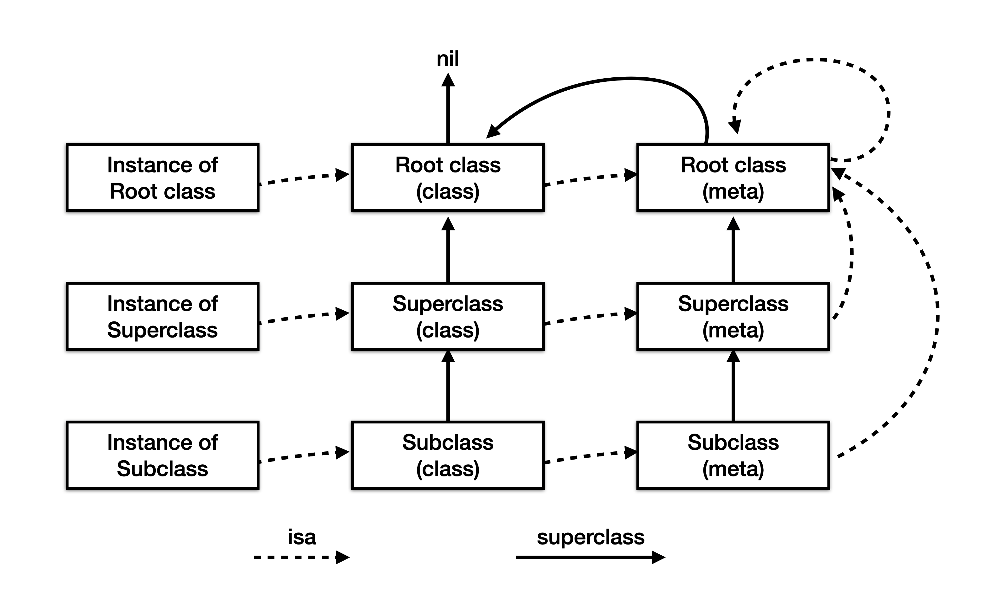
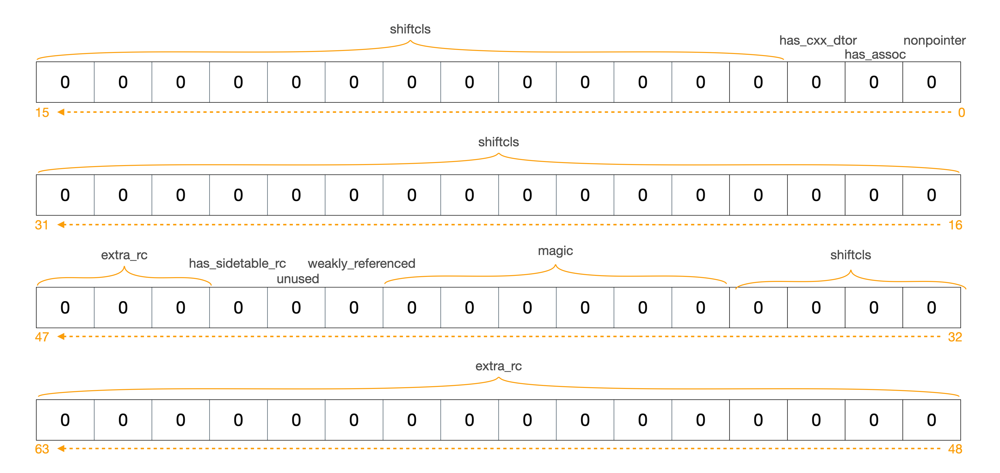
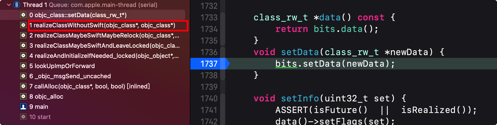
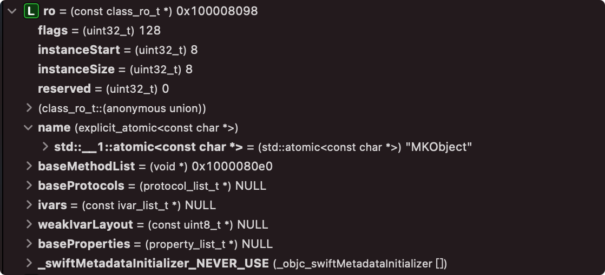
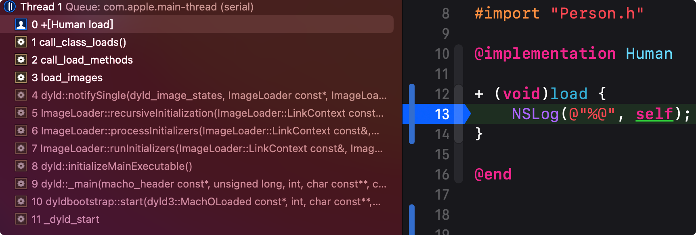
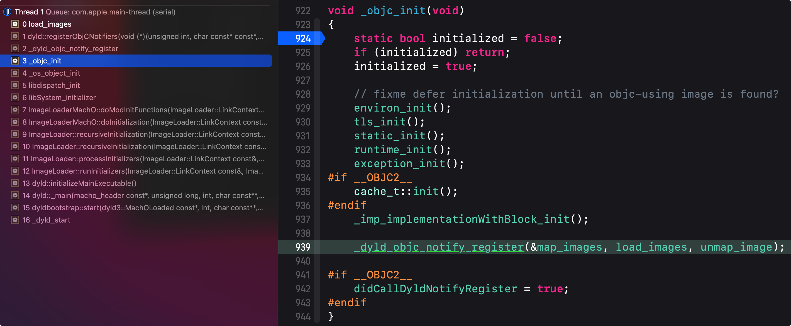

# Runtime

## Runtime简介

​	Runtime运行时是一套C语言的API，作为IOS的内部核心之一，可以实现非常底层的操作。并且我们平时编写的OC代码，在编译期都会编译成为C语言的Runtime代码，例如：

```objective-c
// 函数调用
[receiver message];
// 底层运行时会被编译器转化为
objc_msgSend(receiver, selector)
// 带参数的函数调用
[receiver message:(id)arg...];
// 底层运行时会被编译器转化为
objc_msgSend(receiver, selector, arg1, arg2, ...)
```

> OC源码可以用clang命令*clang -rewrite-objc path1 -o path2*将path1的源码转换为编译后的C代码

​	OC是动态语言，会将尽可能多的决策从编译时和链接时推迟到运行时，基于该特性，OC不仅需要依赖编译器，还需要依赖运行时环境。

​	OC在编译期编译为C语言的Runtime代码，二进制执行过程中执行的都是C语言的代码。OC类本质上都是结构体，在编译时都会以结构体的形式被编译到二进制中。

​	在OC中所有的方法调用都叫做发送消息。

### 使用Runtime

​	Runtime和系统发生交互的方式有三种：

- 通过Objective-C源码：运用上层OC源码，底层会通过Runtime为提供运行时支持，上层不需要关心Runtime运行

  > 即普通的OC方法调用

- 通过Fundation框架的`NSObject`类定义的方法：在OC中大部分的类都继承自NSObject，NSProxy抽象类除外，Runtime在NSObject中定义了一些基础操作，所以继承后的子类也同样有Runtime特性。

  > - -class：方法返回对象所属的类
  > - -isKindOfClass：判断某个对象是否属于某个类或者是其继承体系中的某个类
  > - -isMemberOfClass：判断某个对象是否属于给定类的实例
  > - -respondsToSelector：检查某个对象是否能响应制定的方法
  > - -conformsToProtocol：检查某个对象是否实现了制定协议的方法
  > - -methodForSelector：返回指定方法的实现地址

- 通过对Runtime库函数的直接调用

  > Runtime是一个共享动态库，目录位于*/usr/include/objc/runtime.h*，所以直接引入objc/runtime.h即可使用

### 对象模型

​	下图是对象之间isa的关系以及类的继承关系



​	从Runtime的源码可以看出，每个对象都是一个`objc_object`结构体，**在结构体中有一个isa指针指向自己所属的类，由Runtime负责创建对象**

```objective-c
// Represents an instance of a class.
struct objc_object {
private:
    isa_t isa;
public:
    Class ISA(bool authenticated = false);
    Class rawISA();
    Class getIsa();
  ...
}

struct objc_class : objc_object {
  	...
    // Class ISA;
    Class superclass;
    cache_t cache;             // formerly cache pointer and vtable
    class_data_bits_t bits;    // class_rw_t * plus custom rr/alloc flags
  	...
}

// An opaque type that represents an Objective-C class.
typedef struct objc_class *Class;
```

​	类被定义为`objc_class`结构体，`objc_class`继承自`objc_object`，所以类也是对象，在应用程序中，类只会被创建一份

​	既然类是对象，那么类对象也是其他类的实例。Runtime通过`metaclass`来创建类对象，所以类对象的isa指针指向对应的`meta class`，而`meta class`也是一个对象，所有元类的`isa`都指向其根元类，根元类的`isa`指向自己，使得`isa`整体构成一个闭环

​	在对象的继承体系中，类和元类都有各自的继承体系，但他们都有共同的父类`NSObject`，而`NSObject`的父类指向nil。在上面的类继承关系图中，`Root class(class)`是`NSObject`类的对象，而`Root class(meta)`是`NSObject`的元类对象

## Runtime基础定义

​	在`obcj_private.h`文件中，可见项目中常用的基础定义

```objective-c
/// objc_private.h
typedef struct objc_class *Class;
typedef struct objc_object *id;

typedef struct method_t *Method;
typedef struct ivar_t *Ivar;
typedef struct category_t *Category;
typedef struct property_t *objc_property_t;
```

### IMP

​	参见定义可以理解为`IMP`是一个函数指针，`IMP`默认有两个参数`id`和`SEL`，`id`就是方法中的self，`SEL`就是方法

```objective-c
// objc.h
#if !OBJC_OLD_DISPATCH_PROTOTYPES
// oc
typedef void (*IMP)(void /* id, SEL, ... */ ); 
#else
// swift
typedef id _Nullable (*IMP)(id _Nonnull, SEL _Nonnull, ...); 
#endif
```

​	Runtime中常见的IMP操作函数：

```objective-c
// 获取方法的实现
OBJC_EXPORT IMP _Nonnull 
	method_getImplementation(Method _Nonnull m) 
// 设置方法的实现
OBJC_EXPORT IMP _Nonnull
	method_setImplementation(Method _Nonnull m, IMP _Nonnull imp) 
// 交换两个方法的实现
OBJC_EXPORT void
	method_exchangeImplementations(Method _Nonnull m1, Method _Nonnull m2)   
// 获取类方法的实现  
__attribute__((flatten))
IMP class_getMethodImplementation(Class cls, SEL sel)
```

#### 获取IMP

​	通过定义在`NSObject`下的两个方法，可以根据传入的SEL获取IMP

```objective-c
// 类对象和实例对象都可调用
+ (IMP)methodForSelector:(SEL)sel;
+ (IMP)instanceMethodForSelector:(SEL)sel;
```

​	举例

```objective-c
// c函数指针来接受方法IMP，默认有前两个隐藏参数id、SEL
void (*function) (id, SEL, NSDictionary*);
// oc对象
IMPTest * obj = [IMPTest new];
// 参数内容
NSDictionary * params = @{@"funcName": @"funcTestParam:"};
// IMPTest的funcTestParam函数实现
- (void)funcTestParam:(NSDictionary *)dict {
    NSLog(@"%@ %@", self, dict);
}

// 将c函数指针指向oc方法的实现地址
function = (void (*)(id, SEL, NSDictionary *))[obj methodForSelector:@selector(funcTestParam:)];

// 调用c函数
function(obj, @selector(funcTestParam:), params);
// 调用oc方法
[obj funcTestParam: params];

// 执行结果，调用c函数和OC方法执行结果是相同的
<IMPTest: 0x10380a4c0> {
    funcName = "funcTestParam:";
}
```

​	当遇到大量方法执行，可以通过Runtime获取到IMP，直接调用IMP实现优化

> 直接调用IMP时，注意传入两个隐藏的参数，在申明的时候也应该申明这两个参数

#### IMP block

​	Runtime支持使用`block`的方式回调

```objective-c
// 声明一个使用block实现的IMP
IMP impFunc = imp_implementationWithBlock(^(id obj, NSDictionary* param) {
  NSLog(@"IMP block call %@ %@", obj, param);
});
// 获取funcTestParam的实现
Method funcTestParam = class_getInstanceMethod([obj class], 		  @selector(funcTestParam:));
// 重新设置funcTestParam的实现
method_setImplementation(funcTestParam, impFunc);
// 调用
[obj funcTestParam:params];

// 执行结果，可见funcTestParam方法的实现已经被更改
IMP block call <IMPTest: 0x100509050> {
    funcName = "funcTestParam:";
}
```

### Method

​	`Method`是对方法、函数的封装，查看其定义可知Method时一个`method_t`类型的结构体指针

```objective-c
typedef struct method_t *Method;

struct method_t { 
  // 方法名
  SEL name;
  // 方法编码
	const char *types;
  // 方法实现
	IMP imp; 
};
```

​	Xcode进行编译的时候，只会将`Compile Sources`中`.m`声明的方法编译到`Method List`，而`.h`文件声明的方法对`Method List`没有影响

### objc_property_t

​	`objc_property_t`在Runtime中用来表示对象的属性（使用`@Property`定义）信息，其本质是`property_t`结构体指针

```objective-c
typedef struct property_t *objc_property_t;
struct property_t {
  	// 属性名
    const char *name;
  	// 属性特性
    const char *attributes;
};
```

​	可以通过下面两个函数获取对象的属性列表和协议的属性列表

```objective-c
objc_property_t *
	class_copyPropertyList(Class cls, unsigned int *outCount)
objc_property_t *
	protocol_copyPropertyList(Protocol *proto, unsigned int *outCount)
```

​	可以通过下面两个方法，通过传入的指定Class和属性名，获取具体的属性

```objective-c
objc_property_t 
  class_getProperty(Class cls, const char *name)
objc_property_t
  protocol_getProperty(Protocol *p,
                       const char *name,             
                       BOOL isRequiredProperty, 
                       BOOL isInstanceProperty)
```

### 内存布局

​	类的本质是结构体，在结构体中包含一些成员变量，例如`method list`、`ivar list`等，这些都是结构体的一部分。`method`、`protocol`、`property`的实现这些都可以放到类中，所有对象调用同一份即可，**但对象的成员变量不可以放在一起，因为每个对象的成员变量值都是不同的。**

​	**创建实例对象时，会根据其对应的Class分配内存，内存构成是ivars+isa_t。** 并且实例变量不只包含当前`Class`的`ivars`，也会包含其继承链中的`ivars`。`ivars`的内存布局在编译时就已经决定，运行时需要根据`ivars`内存布局创建对象，所以`Runtime`不能动态修改`ivars`，会破坏已有内存布局

> 并不是所有对象都不能动态修改ivars，如果是通过runtime动态创建的类，是可以修改ivars的

### Ivar读写

​	实例变量的`isa_t`指针会指向其所属的类，对象中并不会包含`method`、`protocol`、`property`、`ivar`等信息，这些信息在编译时都保存在只读结构体`class_ro_t`中。在`class_ro_t`中`ivars`是`const`只读的，在`image load`时`copy`到`class_rw_t`中时，是不会`copy ivars`的，并且`class_rw_t`中并没有定义`ivars`的字段。在访问某个成员变量时，直接通过`isa_t`找到对应的`objc_class`，并通过其`class_ro_t`的`ivar list`做地址偏移，查找对应的对象内存。正是由于这种方式，所以对象的内存地址是固定不可改变的

### 方法传参

​	当调用实例变量的方法时，会通过`objc_msgSend()`发起调用，调用时会传入`self`和`SEL`。函数内部通过`isa`在类的内部查找方法列表对应的`IMP`，传入对应的参数并发起调用。如果调用的方法时涉及到当前对象的成员变量的访问，这时候就是在`objc_msgSend()`内部，通过类的`ivar list`判断地址偏移，取出`ivar`并传入调用的`IMP`中的。

​	调用`super`的方式时则调用`objc_msgSendSuper()`函数实现，调用时将实例变量的父类传进去。但是需要注意的是，调用`objc_msgSendSuper`函数时传入的对象，也是当前实例变量，所以是在向自己发送父类的消息。具体可以看一下`[self class]`和`[super class]`的结果，结果应该都是一样的。

​	在项目中经常会通过`[super xxx]`的方式调用父类方法，这是因为需要先完成父类的操作，当然也可以不调用，视情况而定。以经常见到的自定义`init`方法中，经常会出现`if (self = [super init])`的调用，这是在完成自己的初始化之前先对父类进行初始化，否则只初始化自身可能会存在问题。在调用`[super init]`时如果返回`nil`，则表示父类初始化失败，这时候初始化子类肯定会出现问题，所以需要做判断

## Runtime结构

​	在OC1.0中，Runtime的很多定义都写在`usr/objc/runtime.h`中，比如Runtime基础信息和objc_class的定义

```c
#if !OBJC_TYPES_DEFINED
/// An opaque type that represents a method in a class definition.
typedef struct objc_method *Method;

/// An opaque type that represents an instance variable.
typedef struct objc_ivar *Ivar;

/// An opaque type that represents a category.
typedef struct objc_category *Category;

/// An opaque type that represents an Objective-C declared property.
typedef struct objc_property *objc_property_t;

struct objc_class {
    Class _Nonnull isa  OBJC_ISA_AVAILABILITY;

#if !__OBJC2__
    Class _Nullable super_class                              OBJC2_UNAVAILABLE;
    const char * _Nonnull name                               OBJC2_UNAVAILABLE;
    long version                                             OBJC2_UNAVAILABLE;
    long info                                                OBJC2_UNAVAILABLE;
    long instance_size                                       OBJC2_UNAVAILABLE;
    struct objc_ivar_list * _Nullable ivars                  OBJC2_UNAVAILABLE;
    struct objc_method_list * _Nullable * _Nullable methodLists                    OBJC2_UNAVAILABLE;
    struct objc_cache * _Nonnull cache                       OBJC2_UNAVAILABLE;
    struct objc_protocol_list * _Nullable protocols          OBJC2_UNAVAILABLE;
#endif
} OBJC2_UNAVAILABLE;
/* Use `Class` instead of `struct objc_class *` */
#endif
```

​	可见类对象的方法列表、成员变量列表等都是直接存储在objc_class结构体中的。而在OC2.0中，之前的定义都通过宏定义`OBJC_TYPES_DEFINED`和`OBJC2_UNAVAILABLE`预编译指令废弃掉了，并且`Method`、`IVar`等基础定义的类型也有所改变，现在的`objc_class`定义如下

```c
struct objc_object {
private:
    isa_t isa;
public:
    Class ISA(bool authenticated = false);
    Class rawISA();
    Class getIsa();
	  ...
}

struct objc_class : objc_object {
  	...
    // Class ISA;
    Class superclass;
    cache_t cache;             // formerly cache pointer and vtable
    class_data_bits_t bits;    // class_rw_t * plus custom rr/alloc flags
  	...
}

// An opaque type that represents an Objective-C class.
typedef struct objc_class *Class;
```

### objc_object

​	当创建一个特定的类实例时，所分配的内存中包含objc_object数据结构，在objc_object后紧跟着实例对象的成员变量数据

#### 定义

​	在OC中每一个对象都是一个结构体，结构体中都包含一个isa成员变量，其位于成员变量的第一位，isa之前的类型是Class类型，后来改为isa_t类型

```c
// objc.h
#if !OBJC_TYPES_DEFINED oc2废弃
struct objc_object {
    Class _Nonnull isa  OBJC_ISA_AVAILABILITY;
};

// objc_private.h
struct objc_object {
private:
    isa_t isa;
public:
    // ISA() assumes this is NOT a tagged pointer object
    Class ISA(bool authenticated = false);
    // rawISA() assumes this is NOT a tagged pointer object or a non pointer ISA
    Class rawISA();
    // getIsa() allows this to be a tagged pointer object
    Class getIsa();
    uintptr_t isaBits() const;
	  void initIsa(Class cls /*nonpointer=false*/);
    void initClassIsa(Class cls /*nonpointer=maybe*/);
    void initProtocolIsa(Class cls /*nonpointer=maybe*/);
    void initInstanceIsa(Class cls, bool hasCxxDtor);
  	...
}
```

​	类和元类一样，都是结构体构成的，且类的结构体定义继承自`obj_object`，所以也是一个对象，并且具有对象的`isa`特征，所以可以通过`isa_t`查找对应的类或元类

​	实例对象或类对象的方法，并不会定义在各个对象中，而是定义在`isa_t`指向的类中。查找到对应的类后，通过类的`class_data_bits_t`类型的`bits`结构体查找方法，对象、类、元类都是同样的查找原理

#### isa_t

​	`isa_t`是一个`union`共用体的对象，共用体允许在相同的内存位置存储不同的数据类型，但任何时候只能有一个成员带有值，`isa_t`其内部可以定义成员变量和函数

> union占用的内存空间应该足够存储共用体 中最大的成员

```objective-c
// objc_private.h
union isa_t {
    isa_t() { }
    isa_t(uintptr_t value) : bits(value) { }
    uintptr_t bits;
private:
    Class cls;
public:
#if defined(ISA_BITFIELD)
    struct {
        ISA_BITFIELD;  // defined in isa.h
    };
    bool isDeallocating() {
        return extra_rc == 0 && has_sidetable_rc == 0;
    }
    void setDeallocating() {
        extra_rc = 0;
        has_sidetable_rc = 0;
    }
#endif
    void setClass(Class cls, objc_object *obj);
    Class getClass(bool authenticated);
    Class getDecodedClass(bool authenticated);
};

// ISA_BITFIELD定义，仅在arm64环境下
# if __arm64__
# define ISA_BITFIELD                                                      \
    // 0 标识普通指针，存储了class metaclass对象的地址
		// 1 代表优化过，使用位域存储更多信息
    uintptr_t nonpointer        : 1;                                       \
    // 对象是否有或曾有关联引用，没有关联引用可以更快的释放
    uintptr_t has_assoc         : 1;                                       \
    // 是否有C++析构函数或OC析构函数
    uintptr_t has_cxx_dtor      : 1;                                       \
    // 对象指向类的内存地址，也就是isa指向的地址
    uintptr_t shiftcls          : 33; /*MACH_VM_MAX_ADDRESS 0x1000000000*/ \
    // 对象是否初始化完成
    uintptr_t magic             : 6;                                       \
    // 是否被若引用或被弱引用过
    uintptr_t weakly_referenced : 1;                                       \         
    // 正在释放
    uintptr_t deallocating      : 1;                                       \
    // 对象引用计数太大，是否超出存储区域
    uintptr_t has_sidetable_rc  : 1;                                       \
    // 对象引用计数
    uintptr_t extra_rc          : 19
# endif
```

​	从定义可以看出，`isa_t`使用位域来存储对象信息，长度为8字节64位

> 带有预定义宽度的变量被称为位域

​	下图是`isa_t`初始化后的内存布局，以及各个结构体成员在`isa_t`中的位置



​	查看初始化isa_t的源码

```c
// objc_object.h
inline void 
objc_object::initIsa(Class cls, bool nonpointer, UNUSED_WITHOUT_INDEXED_ISA_AND_DTOR_BIT bool hasCxxDtor)
{ 
    ASSERT(!isTaggedPointer()); 
    isa_t newisa(0);
    if (!nonpointer) {
        newisa.setClass(cls, this);
    } else {
        ASSERT(!DisableNonpointerIsa);
        ASSERT(!cls->instancesRequireRawIsa());
#if SUPPORT_INDEXED_ISA // false
      ...
#else
        newisa.bits = ISA_MAGIC_VALUE;
        // isa.magic is part of ISA_MAGIC_VALUE
        // isa.nonpointer is part of ISA_MAGIC_VALUE
#   if ISA_HAS_CXX_DTOR_BIT
        newisa.has_cxx_dtor = hasCxxDtor;
#   endif
        newisa.setClass(cls, this);
#endif
        newisa.extra_rc = 1;
    }

    // This write must be performed in a single store in some cases
    // (for example when realizing a class because other threads
    // may simultaneously try to use the class).
    // fixme use atomics here to guarantee single-store and to
    // guarantee memory order w.r.t. the class index table
    // ...but not too atomic because we don't want to hurt instantiation
    isa = newisa;
}

// ISA_MAGIC_VALUE定义 isa.h
#   define ISA_MAGIC_VALUE 0x000001a000000001ULL
// ISA_MAGIC_VALUE二进制
0000000000000000000000011010000000000000000000000000000000000001
```

​	在初始化`isa_t`时，通过`ISA_MAGIC_VALUE`赋值给`bits`，`ISA_MAGIC_VALUE`是一个16进制的值，转换为二进制后，对应`isa_t`内存布局，发现`ISA_MAGIC_VALUE`其实是给`nonpointer`和`magic`做初始化，`nonpointer`是对32位处理器做兼容，在访问对象所属的类时，如果是32位则返回之前的isa指针，否则返回`isa_t`结构体，随后初始化`has_cxx_dtor`和`extra_rc`，`has_cxx_dtor`表示是否有C++或者OC的析构方法，在打印方法列表时，可能会看到`.cxx_destruct`这个方法

​	再调用setClass()方法的内部，实现了对shiftcls的初始化，就是对class指针右移三位

```c
inline void
isa_t::setClass(Class newCls, UNUSED_WITHOUT_PTRAUTH objc_object *obj)
{
	#if __has_feature(ptrauth_calls) || TARGET_OS_SIMULATOR // false
    ...
	#elif SUPPORT_INDEXED_ISA // false
    cls = newCls;
	#else // Nonpointer isa, no ptrauth
    shiftcls = (uintptr_t)newCls >> 3;
	#endif
}
```

​	外部获取Class时，应该通过ISA()函数，而不是像之前一样访问isa指针，ISA()函数最终调用到isa对象的getClass方法，在该方法中，将bits与ISA_MASK做与运算，转换ISA_MASK为二进制，发现本质是取出bits的shiftcls，即类的内存地址

```c
inline Class
isa_t::getClass(MAYBE_UNUSED_AUTHENTICATED_PARAM bool authenticated) {
  #if SUPPORT_INDEXED_ISA
  	return cls;
  #else
	  uintptr_t clsbits = bits;
		#if __has_feature(ptrauth_calls)
			...
    #else
    	clsbits &= ISA_MASK;
  	#endif
  	return (Class)clsbits;
	#endif
}

// ISA_MASK定义
#     define ISA_MASK        0x0000000ffffffff8ULL
// 转为二进制
0000000000000000000000000000111111111111111111111111111111111000
```

### objc_class

​	`Runtime`中`objc_class`是一个结构体，继承自`objc_object`，具有对象的所有特征

```c
struct objc_class : objc_object {
  	...
    // Class ISA;
    Class superclass;
    cache_t cache;             // formerly cache pointer and vtable
    class_data_bits_t bits;    // class_rw_t * plus custom rr/alloc flags
	  ...
    class_rw_t *data() const {
      return bits.data();
    }
    void setData(class_rw_t *newData) {
      bits.setData(newData);
    }
  	...
}
```

​	`superclass`指向父类的结构体，`cache`处理已经调用过的方法缓存，`bits`是`objc_class`的重要属性，类型为`class_data_bits_t`。`bits`里面定义了一些基本操作，如获取`class_rw_t`，`raw isa`状态等。`objc_class`结构体中定义的一些函数，内部都是通过`bits`实现的

​	查看`class_data_bits_t`源码

```c
struct class_data_bits_t {
    friend objc_class;
    uintptr_t bits;
private:
   ...
public:
    class_rw_t* data() const {
        return (class_rw_t *)(bits & FAST_DATA_MASK);
    }
    ...
}

typedef unsigned long           uintptr_t
// UL说明FAST_DATA_MASK是 unsigned long类型
#define FAST_DATA_MASK          0x00007ffffffffff8UL
// FAST_DATA_MASK二进制表示
0000000000000000011111111111111111111111111111111111111111111000
```

​	可知`bits`的`data()`函数可以获取到`class_rw_t*`指针，实现的方式是对`bits`和`FAST_DATA_MASK`位运算，`bits`是`uintptr_t`类型，即`unsigned long`类型，在64位处理器中占8字节，刚好64位，将`FAST_DATA_MASK`转为二进制后与`bits`按位与元算，相当于取`bits`的第47-3位置，取出的就是`class_rw_t*`指针。`bits`的后三位是没用的，因为与`FAST_DATA_MASK`运算后，后截取掉后三位，所以可以用这三位存储一些其他信息

``` objective-c
// obj_runtime_new.h
// class is a Swift class from the pre-stable Swift ABI
#define FAST_IS_SWIFT_LEGACY    (1UL<<0)
// class is a Swift class from the stable Swift ABI
#define FAST_IS_SWIFT_STABLE    (1UL<<1)
// 类或父类是否定义了retain/release/等
#define FAST_HAS_DEFAULT_RR     (1UL<<2)
// 数据段
#define FAST_DATA_MASK          0x00007ffffffffff8UL
```

### class_ro_t和class_rw_t

​	`class_ro_t`和`class_rw_t`是与`class_data_bits_t`相关的很重要的两个结构，其中`class_rw_t	`是可读可写的class信息，对象的方法、属性、协议都保存在其中，分类的方法也会在运行时添加到`class_rw_t`中

```c
struct class_rw_t {
    uint32_t flags;
    uint16_t witness;
#if SUPPORT_INDEXED_ISA
    uint16_t index;
#endif
    explicit_atomic<uintptr_t> ro_or_rw_ext;
    Class firstSubclass;
    Class nextSiblingClass;
private:
    ...
public:
    ...
    const method_array_t methods() const { ... }
    const property_array_t properties() const { ... }
    const protocol_array_t protocols() const { ... }
};
```

​	`class_ro_t`存储了编译期类已经确定的属性、方法、协议等，其中不包含分类的方法

```c
struct class_ro_t {
    uint32_t flags;
    uint32_t instanceStart;
    uint32_t instanceSize;
#ifdef __LP64__
    uint32_t reserved;
#endif

    union {
        const uint8_t * ivarLayout;
        Class nonMetaclass;
    };

    explicit_atomic<const char *> name;
    void *baseMethodList;
    protocol_list_t * baseProtocols;
    const ivar_list_t * ivars;

    const uint8_t * weakIvarLayout;
    property_list_t *baseProperties;
		...
}
```

#### class_ro_t和class_rw_t生成时机

在`obc_class`的`setData()`方法下断点来跟踪类初始化时的调用顺序，观察堆栈信息



​	通过断点和堆栈调用顺序得出在`realizeClassWithoutSwift`方法中完成类的初始化，查看其精简源码

```objective-c
static Class realizeClassWithoutSwift(Class cls, Class previously)
{
    runtimeLock.assertLocked();
    class_rw_t *rw;
    Class supercls;
    Class metacls;
  	...
    // class_ro_t在编译器就已经确定
    auto ro = (const class_ro_t *)cls->data();
    auto isMeta = ro->flags & RO_META;
    if (ro->flags & RO_FUTURE) {
        rw = cls->data();
        ro = cls->data()->ro();
        ASSERT(!isMeta);
        cls->changeInfo(RW_REALIZED|RW_REALIZING, RW_FUTURE);
    } else 
        rw = objc::zalloc<class_rw_t>();
        rw->set_ro(ro);
        rw->flags = RW_REALIZED|RW_REALIZING|isMeta;
        cls->setData(rw);
    }

    cls->cache.initializeToEmptyOrPreoptimizedInDisguise();
		...
    supercls = realizeClassWithoutSwift(remapClass(cls->getSuperclass()), nil);
    metacls = realizeClassWithoutSwift(remapClass(cls->ISA()), nil);
		...
    cls->setSuperclass(supercls);
    cls->initClassIsa(metacls);
		...
    cls->setInstanceSize(ro->instanceSize);
		...
    if (supercls) {
        addSubclass(supercls, cls);
    } else {
        addRootClass(cls);
    }

    methodizeClass(cls, previously);
    return cls;
}
```

​	观察`realizeClassWithoutSwift`实现可知， `class_ro_t`在编译期就已经生成，在初始化`class`过程中，会将存储在`bits`中的`class_ro_t`取出，创建`rw`并将`ro`赋值给`rw`，最后调用`setData`方法将`rw`设置给`bits`，同时也更新了`rw`中存储的`ro`

​	执行了这些操作之后，`rw`的`methods`、`protocols`、`properties`都是空的，会执行到`methodizeClass`函数中进行赋值。函数会将`ro`的这些属性都取出来，赋值给`rw`

```c
static void methodizeClass(Class cls, Class previously)
{
    runtimeLock.assertLocked();
    bool isMeta = cls->isMetaClass();
    auto rw = cls->data();
    auto ro = rw->ro();
    auto rwe = rw->ext();
		...
    // Install methods and properties that the class implements itself.
    method_list_t *list = ro->baseMethods();
    if (list) {
        prepareMethodLists(cls, &list, 1, YES, isBundleClass(cls), nullptr);
        if (rwe) rwe->methods.attachLists(&list, 1);
    }

    property_list_t *proplist = ro->baseProperties;
    if (rwe && proplist) {
        rwe->properties.attachLists(&proplist, 1);
    }

    protocol_list_t *protolist = ro->baseProtocols;
    if (rwe && protolist) {
        rwe->protocols.attachLists(&protolist, 1);
    }

    // Root classes get bonus method implementations if they don't have 
    // them already. These apply before category replacements.
    if (cls->isRootMetaclass()) {
        // root metaclass
        addMethod(cls, @selector(initialize), (IMP)&objc_noop_imp, "", NO);
    }

    // Attach categories.
    if (previously) {
        if (isMeta) {
            objc::unattachedCategories.attachToClass(cls, previously,
                                                     ATTACH_METACLASS);
        } else {
            // When a class relocates, categories with class methods
            // may be registered on the class itself rather than on
            // the metaclass. Tell attachToClass to look for those.
            objc::unattachedCategories.attachToClass(cls, previously,
                                                     ATTACH_CLASS_AND_METACLASS);
        }
    }
    objc::unattachedCategories.attachToClass(cls, cls,
                                             isMeta ? ATTACH_METACLASS : 			ATTACH_CLASS);
  ...
}
```

​	声明一个类`MKObject`继承自`NSObject`，添加一个`testMethod`方法，打印编译后的`class_ro_t`结构体



​	打印可以看出，class_ro_t只会包含当前类的信息，不包含父类信息

### 关系图


### TaggedPointer

​	从64位系统开始，Runtime引入了`TaggedPointer`技术，用于优化小对象（NSString、NSNumber、NSDate）的存储。在32位系统中，一个指针占4字节，在64位中占8字节，所以在64位机器上程序内存占用会多出很多。而且OC对象需要动态分配内存，维护引用计数等，效率不可避免有所降低。引入TaggedPointer技术后、指针直接存储了对象的值，降低内存占用，提升创建和读取效率

> 详细：[TaggedPointer](https://blog.csdn.net/u014600626/article/details/108661595)

## Runtime源码

​	alloc、init、new、dealloc、addMethod、添加Ivar、Protocol、SEL

### alloc

​	alloc调用流程

> +alloc/_objc_rootAlloc/callAlloc

#### callAlloc

​	在callAlloc函数中，会进行编译优化，并且这一步并不是alloc的核心实现步骤

```c
// alloc和allocWithZone进入到这里，会进行编译器优化
callAlloc(Class cls, bool checkNil, bool allocWithZone=false)
{
#if __OBJC2__
  	// cls判空，返回nil
    if (slowpath(checkNil && !cls)) return nil;
    // 是否有自定义的allocWitZone实现
    if (fastpath(!cls->ISA()->hasCustomAWZ())) {
      	//实际的alloc实现
        return _objc_rootAllocWithZone(cls, nil);
    }
#endif
		// 兼容oc1，oc1通过objc_msgSend来实现
    if (allocWithZone) {
        return ((id(*)(id, SEL, struct _NSZone *))objc_msgSend)(cls, @selector(allocWithZone:), nil);
    }
    return ((id(*)(id, SEL))objc_msgSend)(cls, @selector(alloc));
}

```

> \_\_OBJC2\_\_：Objective2.0版本，在2.0版本中增加了可用的编译器优化
>
> fastpath和slowpath定义，参考https://www.jianshu.com/p/536824702ab6
>
> ```swift
> // exp==n的概率很大，由GCC提供的告诉编译器分支转移信息，减少指令跳转带来的性能下降
> __builtin_expect(exp, n)
> 
> // 表示x为真的概率更大
> #define fastpath(x) (__builtin_expect(bool(x), 1))
> // 表示x为假的概率更大
> #define slowpath(x) (__builtin_expect(bool(x), 0))
> ```

#### _objc_rootAllocWithZone

​	此方法也是兼容oc1，在oc2中不再使用，所以zone参数传入nil

> 参考https://www.cnblogs.com/azxfire/p/3820025.html

#### _class_createInstanceFromZone

​	这一步是alloc的核心实现步骤，分为三步

- cls->instanceSize：计算对象需要的内存空间

- calloc：申请内存，obj内存地址

- obj->initInstanceIsa：创建isa，将isa和obj关联

  ```c
  // alloc的核心方法
  static ALWAYS_INLINE id
  _class_createInstanceFromZone(Class cls, size_t extraBytes, void *zone,
                                int construct_flags = OBJECT_CONSTRUCT_NONE,
                                bool cxxConstruct = true,
                                size_t *outAllocatedSize = nil)
  {
      ASSERT(cls->isRealized());
    
      // 一次读取类的信息位以提高性能
      bool hasCxxCtor = cxxConstruct && cls->hasCxxCtor();
      bool hasCxxDtor = cls->hasCxxDtor();
      bool fast = cls->canAllocNonpointer();
      size_t size;
  
      // 1、内存大小
    	// 内存对齐
      size = cls->instanceSize(extraBytes);
      if (outAllocatedSize) *outAllocatedSize = size;
  
      id obj;
      if (zone) {
          obj = (id)malloc_zone_calloc((malloc_zone_t *)zone, 1, size);
      } else {
          // 2、申请内存，并赋值给obj
          obj = (id)calloc(1, size);
      }
      if (slowpath(!obj)) {
          if (construct_flags & OBJECT_CONSTRUCT_CALL_BADALLOC) {
              return _objc_callBadAllocHandler(cls);
          }
          return nil;
      }
  
      if (!zone && fast) {
          // 3、初始化isa并与obj关联
          obj->initInstanceIsa(cls, hasCxxDtor);
      } else {
          // Use raw pointer isa on the assumption that they might be
          // doing something weird with the zone or RR.
          obj->initIsa(cls);
      }
  
      if (fastpath(!hasCxxCtor)) {
          return obj;
      }
  
      construct_flags |= OBJECT_CONSTRUCT_FREE_ONFAILURE;
      return object_cxxConstructFromClass(obj, cls, construct_flags);
  }
  ```


##### instanceSize	

​	instanceSize函数计算存储对象需要的内存大小，为了提高存储和IO效率，使用内存对齐来计算内存大小

##### 内存对齐

​	在64位系统中，cpu每次能从内存取出的的对齐大小为8字节的内存如[0-7]，[8-15]，内存对齐就可以提高cpu访问内存数据的效率，是一种以空间换时间的优化方式。

​	物理层面原因：https://zhuanlan.zhihu.com/p/83449008

​	对齐原则：

1. 成员变量：作为类或者结构体的成员变量，第一个变量放在offset为0的地方，以后每个成员变量的存储位置从该成员的大小或者成员的子成员（数组，结构体，类）的整数倍开始。
2. 在类或者结构体中定义了其他类或结构体：成员变量从其内部最大元素大小的整数倍地址开始布局
3. 整体对齐规则：类或结构体的总大小，即sizeof的结果，必须是其内部最大成员的整数倍，不足的要补齐

```c
typedef struct Body {
    int id;         //  4字节   [0-3]
    double weight;  //  8字节   [8-15]	原则1
    float height;   //  4字节   [16-29] 对齐 [20-23]	原则2
} Body;

typedef struct Stu {
    char name[2];   // 2字节   [0-1]
    int id;         // 4字节   [4-7]	原则1
    double score;   // 8字节   [8-15]	
    short grade;    // 2字节   [16-17]
    struct Body body;   // 24字节 [24-47]	原则2
} Stu;

sizeof(Body)	// 24
sizeof(Stu))	// 48
```

​	在iOS中，使用16字节对齐，在OC对象中，第一个位是isa指针，占了8个字节，如果对象中没有其他属性，对象至少占8字节。如果iOS以8字节对齐，连续的两个没有其他属性的对象内存是完全挨在一起的，可能造成访问出错，参考https://www.jianshu.com/p/e01fffd22091。

​	objc中，16位内存对齐实现

> ```c
> static inline size_t align16(size_t x) {
> 	//  x >> 3 << 3
>  return (x + size_t(15)) & ~size_t(15);
> }
> ```

##### calloc

​	申请大小为instanceSize的内存，并使得obj指向该地址

```objective-c
obj = (id)calloc(1, size);
```

​	此时，打印obj，发现obj指向一个16位的地址

```lldb
(lldb) po obj
0x0000000101247740
```

​	但是打印结果并不像打印其他OC对象一样类似于<Person: 0x0011111f>的指针呢，因为这一步只开辟了内存地址，并没有与cls关联。

> 可以看出alloc的本质作用就是开辟对象的内存

##### initInstanceIsa

​	创建cls的isa并与obj关联，每个继承自NSObject的OC对象都可以通过isa连接到运行时系统，获取到对象的类，而类的isa又指向了其元类，如此就可以找到静态方法和变量了。

```c
// 新建isa指针
isa_t newisa(0);
// 关联cls
newisa.setClass(cls, this)
```

​	初始化isa并关联cls后，赋值给obj

```objective-c
obj->initInstanceIsa(cls, hasCxxDtor);
```

​	此时，打印obj

```
(lldb) po obj
<Person: 0x10131f780>
```

​	至此，可以得出alloc方法主要工作就是开辟对象内存，并使用里内存16字节对齐的优化，其核心步骤位：`计算内存`/`申请内存`/`关联类`

### init

​	init方法用于初始化对象，可以分为`类init`和`对象init`

#### 类init

​	 类init是一个构造方法，通过工厂设计提供给子类构造方法入口，在字节对齐后，可以强转为需要的类型

```objective-c
+ (id)init {
    return (id)self;
}
```

#### 对象init

​	对象init返回的仍然是对象本身

```objective-c
- (id)init {
    return _objc_rootInit(self);
}
```

```c
id _objc_rootInit(id obj) {
    return obj;
}
```

​	所以init方法就是提供一个统一的构造方法，来初始化对象

### new

​	创建对象通可以用new方法，

```objective-c
Person * p = [Person new];
```

​	new内部同样调用了alloc方法调用的`callAlloc`方法，在创建了对象后，有调用了`init`方法，所以new等价于`[[xxx alloc] init]`

```objective-c
+ (id)new {
    return [callAlloc(self, false/*checkNil*/) init];
}
```

​	但是实际开发中，用到new的方法很少，原因在于new内部创建了对象后，直接调用了init方法，但是实际情况下一个类可能还有其他成员属性需要初始化，例如`UIView`类的`initWithFrame`方法，所以此种情况下就不适合使用new方法了

### dealloc

​	对象销毁时，会自动调用`dealloc`方法，查看源码可知最终调用的是`objc_object::rootDealloc()`函数来销毁对象

```c++
inline void
objc_object::rootDealloc()
{
    if (isTaggedPointer()) return;  // fixme necessary?

    if (fastpath(isa.nonpointer                     &&
                 // 是否被若引用或被弱引用过
                 !isa.weakly_referenced             &&
                 // 是否有关联引用
                 !isa.has_assoc                     &&
#if ISA_HAS_CXX_DTOR_BIT // 1
                 // 是否有析构函数
                 !isa.has_cxx_dtor                  &&
#else
                 !isa.getClass(false)->hasCxxDtor() &&
#endif
                 // 对象引用计数太大，是否超出存储区域
                 !isa.has_sidetable_rc))
    {
        assert(!sidetable_present());
        free(this);
    } 
    else {
        object_dispose((id)this);
    }
}
```

​	如果在`ARC`环境下，定义了实例变量，才会进入到else分支，执行o`bject_dispose`方法，否则进入到if，if中表示当前对象没有实例变量，直接`free`对象

​	在`object_dispose`中，最终会调用`objc_destructInstance`函数，在该函数内部主要做了三件事

```c
void *objc_destructInstance(id obj) 
{
    if (obj) {
        // Read all of the flags at once for performance.
        bool cxx = obj->hasCxxDtor();
        bool assoc = obj->hasAssociatedObjects();

        // This order is important.
        if (cxx) object_cxxDestruct(obj);
        if (assoc) _object_remove_assocations(obj, /*deallocating*/true);
        obj->clearDeallocating();
    }
    return obj;
}
```

1. 对对象进行析构：调用`object_cxxDestruct`函数

2. 移除对象的所有关联关系

3. clear操作

   `object_cxxDestruct`的内部是调用`object_cxxDestructFromClass`来实现的，这个函数会遍历继承链，不断调用`.cxx_destruct`函数，对传入的对象进行析构，这是因为在继承者链中，每个类都有自己的析构代码，所以需要逐个执行析构操作，直到所有析构操作全部完成

   ```c
   static void object_cxxDestructFromClass(id obj, Class cls)
   {
       void (*dtor)(id);
   	  // 遍历继承链，直到根类
       for ( ; cls; cls = cls->getSuperclass()) {
           if (!cls->hasCxxDtor()) return; 
         	// SEL_cxx_destruct就是.cxx_destruct的selector
           dtor = (void(*)(id))
               lookupMethodInClassAndLoadCache(cls, SEL_cxx_destruct);
           if (dtor != (void(*)(id))_objc_msgForward_impcache) {
               if (PrintCxxCtors) {
                   _objc_inform("CXX: calling C++ destructors for class %s", 
                                cls->nameForLogging());
               }
             	// 获取到.cxx_destruct的地址并调用
               (*dtor)(obj);
           }
       }
   }
   ```

### addMethod实现

​	动态添加函数或替换函数实现，会用到两个Runtime方法：

```c
// 动态添加方法
BOOL class_addMethod(Class cls, SEL name, IMP imp, const char *types)
{
    if (!cls) return NO;
    mutex_locker_t lock(runtimeLock);
    return ! addMethod(cls, name, imp, types ?: "", NO);
}

// 替换方法实现
IMP class_replaceMethod(Class cls, SEL name, IMP imp, const char *types)
{
    if (!cls) return nil;
    mutex_locker_t lock(runtimeLock);
    return addMethod(cls, name, imp, types ?: "", YES);
}
```

​	可以看到两个方法内部都调用了`addMethod`方法，通过该最后一个参数`replace`来区分是添加还是替换

```c
static IMP addMethod(Class cls, SEL name, IMP imp, const char *types, bool replace)
{
    IMP result = nil;
    runtimeLock.assertLocked();
    checkIsKnownClass(cls);
    
    ASSERT(types);
    ASSERT(cls->isRealized());

    method_t *m;
    if ((m = getMethodNoSuper_nolock(cls, name))) {
        // already exists
        if (!replace) { result = m->imp(false); } 
      	else {
            result = _method_setImplementation(cls, m, imp);
        }
    } else {
        // fixme optimize
        method_list_t *newlist;
        newlist = (method_list_t *)calloc(method_list_t::byteSize(method_t::bigSize, 1), 1);
        newlist->entsizeAndFlags = 
            (uint32_t)sizeof(struct method_t::big) | fixed_up_method_list;
        newlist->count = 1;
        auto &first = newlist->begin()->big();
        first.name = name;
        first.types = strdupIfMutable(types);
        first.imp = imp;

        addMethods_finish(cls, newlist);
        result = nil;
    }
    return result;
}
```

​	在`addMethod`方法中，先判断了要添加的方法是否存在，存在并且不是替换的话，直接返回方法的`IMP`，如果要替换原有实现，，就直接调用`_method_setImplementation`方法设置对应方法的实现

​	如果方法不存在，创建一个`method_list_t`结构体指针、并设置方法名`name`、参数和返回类型`types`和方法实现`imp`，然后调用`addMethods_finish`/`attachLists`/`setArray`函数添加方法

```c
static void
addMethods_finish(Class cls, method_list_t *newlist)
{
    auto rwe = cls->data()->extAllocIfNeeded();
		...
    rwe->methods.attachLists(&newlist, 1);
		...
}
void attachLists(List* const * addedLists, uint32_t addedCount) {
    if (hasArray()) {
        // many lists -> many lists
        uint32_t oldCount = array()->count;
        uint32_t newCount = oldCount + addedCount;
        array_t *newArray = (array_t *)malloc(array_t::byteSize(newCount));
        newArray->count = newCount;
        array()->count = newCount;

        for (int i = oldCount - 1; i >= 0; i--)
            newArray->lists[i + addedCount] = array()->lists[i];
        for (unsigned i = 0; i < addedCount; i++)
            newArray->lists[i] = addedLists[i];
        free(array());
        setArray(newArray);
        validate();
    }
		...
}
void setArray(array_t *array) {
  	arrayAndFlag = (uintptr_t)array | 1;
}
```

### Ivar

​	Runtime不能向已经存在的类添加实例变量，但是可以向动态创建的类添加实例变量，在这种场景下，必须将添加实例变量写在调用`objc_allocateClassPair`函数创建类之后，以及调用`objc_registerClassPair`函数注册类之前，否则会添加失败。不能向一个元类添加实例变量。

```objective-c
Class TestClass = objc_allocateClassPair([NSObject class], "TestObject", 0);
bool ivarBool = class_addIvar(TestClass, "testIvar", sizeof(NSString *), log2(sizeof(NSString *)), @encode(NSString *));
objc_registerClassPair(TestClass);        
id testObj = [[TestClass alloc] init];
if (ivarBool) {
  [testObj setValue:@"testIvarValue" forKey:@"testIvar"];
  MKLog(@"%@", [testObj valueForKey:@"testIvar"]);
}
```

​	如果将添加实例变量的方法写在注册类之后，不能成功添加实例变量。

​	查看`objc_allocateClassPair`创建类的源码

```c
// objc_runtime_new.mm
Class objc_allocateClassPair(Class superclass, const char *name, 
                             size_t extraBytes) {
    Class cls, meta;

    // Fail if the class name is in use.
    if (look_up_class(name, NO, NO)) return nil;

    mutex_locker_t lock(runtimeLock);

    // Fail if the class name is in use.
    // Fail if the superclass isn't kosher.
    if (getClassExceptSomeSwift(name)  ||
        !verifySuperclass(superclass, true/*rootOK*/))
    {
        return nil;
    }

    // Allocate new classes.
    cls  = alloc_class_for_subclass(superclass, extraBytes);
    meta = alloc_class_for_subclass(superclass, extraBytes);

    // fixme mangle the name if it looks swift-y?
    objc_initializeClassPair_internal(superclass, name, cls, meta);

    return cls;
}
```

​	首先通过判断类名是否已经被使用，校验父类是否可用，否则创建失败。然后通过`alloc_class_for_subclass`函数创建目标类和元类，该函数内部主要是分配空间，未做其他操作。然后执行`objc_initializeClassPair_internal`函数，该函数内部主要用于初始化目标类和元类，在`objc_initializeClassPair_internal`内部调用`addClassTableEntry`函数，将目标类添加到所有类表中，执行完这些操作，外部可以通过`class_addIvar`函数添加实例变量

​	在创建了目标类之后，通过objc_registerClassPair函数注册目标类

```c
// objc_runtime_new.mm
void objc_registerClassPair(Class cls)
{
    mutex_locker_t lock(runtimeLock);

    checkIsKnownClass(cls);

    if ((cls->data()->flags & RW_CONSTRUCTED)  ||
        (cls->ISA()->data()->flags & RW_CONSTRUCTED)) 
    {
        _objc_inform("objc_registerClassPair: class '%s' was already "
                     "registered!", cls->data()->ro()->getName());
        return;
    }

    if (!(cls->data()->flags & RW_CONSTRUCTING)  ||  
        !(cls->ISA()->data()->flags & RW_CONSTRUCTING))
    {
        _objc_inform("objc_registerClassPair: class '%s' was not "
                     "allocated with objc_allocateClassPair!", 
                     cls->data()->ro()->getName());
        return;
    }

    // Clear "under construction" bit, set "done constructing" bit
    cls->ISA()->changeInfo(RW_CONSTRUCTED, RW_CONSTRUCTING | RW_REALIZING);
    cls->changeInfo(RW_CONSTRUCTED, RW_CONSTRUCTING | RW_REALIZING);

    // Add to named class table.
    addNamedClass(cls, cls->data()->ro()->getName());
}
```

​	函数内部首先判断添加的类名是否被占用，判断添加类是否已经被注册和判断类时候申请了分配内存空间，然后设置目标类和元类的构建状态，最后调用addNamedClass函数将新类添加到非元类映射

```c
static void addNamedClass(Class cls, const char *name, Class replacing = nil)
{
    runtimeLock.assertLocked();
    Class old;
    if ((old = getClassExceptSomeSwift(name))  &&  old != replacing) {
        inform_duplicate(name, old, cls);

        // getMaybeUnrealizedNonMetaClass uses name lookups.
        // Classes not found by name lookup must be in the
        // secondary meta->nonmeta table.
        addNonMetaClass(cls);
    } else {
        NXMapInsert(gdb_objc_realized_classes, name, cls);
    }
    ASSERT(!(cls->data()->flags & RO_META));
}
```

​	无论是注册类还是注册元类，内部都是通过`NXMapInsert`函数实现的。在Runtime中，所有类都是保存到一个哈希表中的，在`table`的`buckets`中存储，每次创建新类，都需要将该类添加入哈希表

```c
void *NXMapInsert(NXMapTable *table, const void *key, const void *value) {
    MapPair	*pairs = (MapPair *)table->buckets;
	  // 计算key在当前hash表中的下标
    unsigned	index = bucketOf(table, key);
	  // 找到buckets首地址，通过index下标计算对应位置，获取到index对应的Mappair
    MapPair	*pair = pairs + index;
   // 如果key为空，返回
    if (key == NX_MAPNOTAKEY) {
      _objc_inform("*** NXMapInsert: invalid key: -1\n");
      return NULL;
    }

    unsigned numBuckets = table->nbBucketsMinusOne + 1;
		// 如果当前地址未冲突，直接对pair赋值
    if (pair->key == NX_MAPNOTAKEY) {
      pair->key = key; pair->value = value;
      table->count++;
      if (table->count * 4 > numBuckets * 3) _NXMapRehash(table);
      return NULL;
    }
  
	  // hash冲突了
    
	  // 如果同名，将旧类替换成新类
    if (isEqual(table, pair->key, key)) {
      const void	*old = pair->value;
      if (old != value) pair->value = value;/* avoid writing unless needed! */
      return (void *)old;
    } 
  	// hash满了，重做hash，然后重新调用	
	  else if (table->count == numBuckets) {
      /* no room: rehash and retry */
      _NXMapRehash(table);
      return NXMapInsert(table, key, value);
    } 
  	// hash冲突
  	else {
      unsigned	index2 = index;
      // 解决hash冲突，线性探测发，解决哈希表冲突
      while ((index2 = nextIndex(table, index2)) != index) {
        pair = pairs + index2;
        if (pair->key == NX_MAPNOTAKEY) {
          pair->key = key; pair->value = value;
          table->count++;
          // 哈希表不够用，重哈希
          if (table->count * 4 > numBuckets * 3) _NXMapRehash(table);
          return NULL;
	    }
      // 找到同名类，新类替换旧类，返回
	    if (isEqual(table, pair->key, key)) {
        const void	*old = pair->value;
        if (old != value) pair->value = value;/* avoid writing unless needed! */
        return (void *)old;
	    }
	}
      /* no room: can't happen! */
      _objc_inform("**** NXMapInsert: bug\n");
      return NULL;
    }
}
```

#### 数据的访问

​	在定义对象的时候都会给对象设置一个类型，类型本质上不是一个对象，而是用来标示当前对象所占用的空间大小，以C语言为例，访问对象都是通过地址来访问，类型就是从首地址开始，读取多少位是当前对象。

```c
// int类型的num，占用4字节
int num = 1;
// char类型a，占用1字节
char a = 'a';
```

​	在访问对象时，根据指针地址找到对应的内存区域，然后按照执政类型存取多少范围的内存，就完成了对象的存取操作

#### 不能向已经存在的类添加ivars

​	在编译期只读结构题`class_ro_t`就会被确定，在运行时是不可以更改的，`ro`中有一个字段`instanceSize`表示当前类在创建对象时需要多少空间，当创建对象时根据该空间分配内存。如果对一个已经存在的类增加一个成员变量，改变了`ivars`的结构，在访问改变之前创建的对象时，就会出现错误，因为内存内存结构变了，占用的内存大小就变了，访问新添加的成员变量就会导致地址越界

### Protocol

​	协议声明了一些必须实现的方法和选择实现的方法，即声明了一些统一的借口由继承类去实现。协议是`protocol_t`结构体的对象，`protocol_t`结构体继承自`objc_object`，具备对象的特征

```c
// objc_runtime_new.h
struct protocol_t : objc_object {
    const char *mangledName;
    struct protocol_list_t *protocols;
    method_list_t *instanceMethods;
    method_list_t *classMethods;
    method_list_t *optionalInstanceMethods;
    method_list_t *optionalClassMethods;
    property_list_t *instanceProperties;
    uint32_t size;   // sizeof(protocol_t)
    uint32_t flags;
    // Fields below this point are not always present on disk.
    const char **_extendedMethodTypes;
    const char *_demangledName;
    property_list_t *_classProperties;

    const char *demangledName();

    const char *nameForLogging() {
        return demangledName();
    }
		
  	...	

    property_list_t *classProperties() const {
        return hasClassPropertiesField() ? _classProperties : nil;
    }
};
```

​	`protocol_t`定义了一些独有的参数，如实例方法、类方法、可选实例方法、可选类方法、属性集合等

​	`protocol_t`具有对象的特征，有isa指针，在`Protocol`中所有的`isa`都指向同一个类`Protocol`，`Protocol`中至实现了一些基础方法

```objective-c
// Protocol.mm
@implementation Protocol

- (BOOL) conformsTo: (Protocol *)aProtocolObj {
    return protocol_conformsToProtocol(self, aProtocolObj);
}

- (struct objc_method_description *) descriptionForInstanceMethod:(SEL)aSel {
#if !__OBJC2__
    return lookup_protocol_method((struct old_protocol *)self, aSel, 
                                  YES/*required*/, YES/*instance*/, 
                                  YES/*recursive*/);
#else
    return method_getDescription(protocol_getMethod((struct protocol_t *)self, 
                                                     aSel, YES, YES, YES));
#endif
}

- (struct objc_method_description *) descriptionForClassMethod:(SEL)aSel {
#if !__OBJC2__
    return lookup_protocol_method((struct old_protocol *)self, aSel, 
                                  YES/*required*/, NO/*instance*/, 
                                  YES/*recursive*/);
#else
    return method_getDescription(protocol_getMethod((struct protocol_t *)self, 
                                                    aSel, YES, NO, YES));
#endif
}

- (const char *)name {
    return protocol_getName(self);
}

- (BOOL)isEqual:other {
#if __OBJC2__
    // check isKindOf:
    Class cls;
    Class protoClass = objc_getClass("Protocol");
    for (cls = object_getClass(other); cls; cls = cls->getSuperclass()) {
        if (cls == protoClass) break;
    }
    if (!cls) return NO;
    // check equality
    return protocol_isEqual(self, other);
#else
    return [other isKindOf:[Protocol class]] && [self conformsTo: other] && [other conformsTo: self];
#endif
}

#if __OBJC2__
- (NSUInteger)hash {
    return 23;
}
#else

- (unsigned)hash {
    return 23;
}
#endif

@end
```

​	协议的初始化是在`_read_images`函数中完成的，初始化过程主要是一个遍历，获取`protocol list`，然后遍历整个数组，并调用`readProtocol`函数进行初始化操作

```c
// 遍历所有协议列表，并将协议列表加载到Protocol哈希表中
for (EACH_HEADER) {
    extern objc_class OBJC_CLASS_$_Protocol;
	  // Protocol类，所有协议和对象的结构题都类似，isa都对应Protocol类
    Class cls = (Class)&OBJC_CLASS_$_Protocol;
    ASSERT(cls);
    // 获取protocol哈希表
    NXMapTable *protocol_map = protocols();
    bool isPreoptimized = hi->hasPreoptimizedProtocols();
		...
    bool isBundle = hi->isBundle();
		// 从编译器中读取并初始化protocol
    protocol_t * const *protolist = _getObjc2ProtocolList(hi, &count);
    for (i = 0; i < count; i++) {
        readProtocol(protolist[i], cls, protocol_map, 
                     isPreoptimized, isBundle);
    }
}
```

​	Protocol可以在运行时动态添加，和创建Class的过程类似，分为创建和注册两部分，只有在注册后才可以使用

```objective-c
// objc_runtime_new.mm
// 创建新的Protocol
Protocol * objc_allocateProtocol(const char *name) {
    mutex_locker_t lock(runtimeLock);
	  // 检查协议名是否被注册
    if (getProtocol(name)) {
        return nil;
    }
 	  // 申请内存
    protocol_t *result = (protocol_t *)calloc(sizeof(protocol_t), 1);

	  // 未完成的protocol
    extern objc_class OBJC_CLASS_$___IncompleteProtocol;
    Class cls = (Class)&OBJC_CLASS_$___IncompleteProtocol;
    result->initProtocolIsa(cls);
    result->size = sizeof(protocol_t);
    // fixme mangle the name if it looks swift-y?
    result->mangledName = strdupIfMutable(name);
    // fixme reserve name without installing
    return (Protocol *)result;
}

// 注册Protocol
void objc_registerProtocol(Protocol *proto_gen) {
    protocol_t *proto = newprotocol(proto_gen);

    mutex_locker_t lock(runtimeLock);

    extern objc_class OBJC_CLASS_$___IncompleteProtocol;
    Class oldcls = (Class)&OBJC_CLASS_$___IncompleteProtocol;
    extern objc_class OBJC_CLASS_$_Protocol;
    Class cls = (Class)&OBJC_CLASS_$_Protocol;

  	// 新协议是否被注册
    if (proto->ISA() == cls) {
        _objc_inform("objc_registerProtocol: protocol '%s' was already "
                     "registered!", proto->nameForLogging());
        return;
    }
	  // 新协议有错误
    if (proto->ISA() != oldcls) {
        _objc_inform("objc_registerProtocol: protocol '%s' was not allocated "
                     "with objc_allocateProtocol!", proto->nameForLogging());
        return;
    }

    // NOT initProtocolIsa(). The protocol object may already 
    // have been retained and we must preserve that count.
    proto->changeIsa(cls);

    // Don't add this protocol if we already have it.
    // Should we warn on duplicates?
    if (getProtocol(proto->mangledName) == nil) {
        NXMapKeyCopyingInsert(protocols(), proto->mangledName, proto);
    }
}
```

### SEL

​	`SEL`表示方法的名称

```c
// objc.h
typedef struct objc_selector *SEL;
```

​	在源码中虽然`SEL`定义为一个`objc_selector`类型的结构题指针，实际上它是一个常量字符串。在`_read_images`的`SEL list`实现中，主要逻辑是加载`SEL list`到内存中，然后通过`sel_registerNameNoLock`函数，将所有`SEL`都注册到术语`SEL`的哈希表中	

```c
// 将所有SEL都注册到SEL哈希表中
static size_t UnfixedSelectors;
{
    mutex_locker_t lock(selLock);
    for (EACH_HEADER) {
        if (hi->hasPreoptimizedSelectors()) continue;

        bool isBundle = hi->isBundle();
        // 字符串数组
        SEL *sels = _getObjc2SelectorRefs(hi, &count);
        UnfixedSelectors += count;
        for (i = 0; i < count; i++) {
            // 将SEL强转位常量字符串
            const char *name = sel_cname(sels[i]);
          	// 注册SEL
            SEL sel = sel_registerNameNoLock(name, isBundle);
            if (sels[i] != sel) {
                sels[i] = sel;
            }
        }
    }
}

static const char *sel_cname(SEL sel) {
    return (const char *)(void *)sel;
}

SEL sel_registerNameNoLock(const char *name, bool copy) {
    return __sel_registerName(name, 0, copy);  // NO lock, maybe copy
}
```

​	可以看到`sel_cname`函数就是将`SEL`强制转换为常量字符串，从`sel_registerNameNoLock`的入参也可以看出来，所以`SEL`本质就是一个常量字符串

## Runtime加载过程

在类的`load`方法里面下断点，追踪`load`方法的调用流程



可以看到`load`调用由`load_images`发起，继续下断点



观察到`load_images`由`_objc_init`调起，而程序的最开始由`_dyld_start`开始

程序的启动依赖很多系统动态库，动态库通过`dylb`（动态库链接器）加载到内存中，在`dylb`加载之前，由`libSystem`调起`_objc_init`函数，以引导程序初始化，查看`_objc_init`源码

```c
void _objc_init(void)
{
    // 前面是初始化操作...
	  //
    _dyld_objc_notify_register(&map_images, load_images, unmap_image);
		// ...
}
```

_objc_init注册了三个函数指针，map_images当image被dylb加载到内存后会调用。load_images当dylb 初始化image时会调用，这一步，会调用Class的+load方法。unmap_image当dylb要从内存中移除image时会调用。

### map_images

在map_images中，相继调用map_images_nolock、_read_images函数，最终目的是对headerList中的头文件进行初始化处理

### load_images

通过断点可知道`+load`方法先于`main`方法调用，每个`NSObject`的子类都包含一个`+load`方法，load方法只会调用一次，适合做一些一次性操作，比如方法交换

> Category中实现了load方法是不会覆盖原类load方法的，所有Category的load方法都会执行

前面已经知道`load`方法由`load_image`方法调起，`load_image`通过`_dyld_objc_notify_register`方法将自己注册给`dylb`，由`dylb`调用

```c
void
load_images(const char *path __unused, const struct mach_header *mh) {
 		// 是否加载了Category
    if (!didInitialAttachCategories && didCallDyldNotifyRegister) {
        didInitialAttachCategories = true;
        loadAllCategories();
    }
    // 没有load方法就返回
    if (!hasLoadMethods((const headerType *)mh)) return;
    recursive_mutex_locker_t lock(loadMethodLock);
    // 准备类和Category的load方法，分别存储在loadable_classes和loadable_classes里面
    {
        mutex_locker_t lock2(runtimeLock);
        prepare_load_methods((const headerType *)mh);
    }
    // 调用load方法
    call_load_methods();
}
```

由源码可知，`load_images`方法里调用`load`方法分为两步，先调用`prepare_load_methods`准备类和Category的load方法，然后通过`call_load_methods`执行load方法

在`prepare_load_methods` 方法内部，也分为`class`和`category`两部分来查找`load`

```c
void prepare_load_methods(const headerType *mhdr){
    size_t count, i;
    runtimeLock.assertLocked();
  	// 非懒加载类列表
    classref_t const *classlist = _getObjc2NonlazyClassList(mhdr, &count);
    for (i = 0; i < count; i++) {
      	// 递归类和其父类的load方法
        schedule_class_load(remapClass(classlist[i]));
    }
  	// 非懒加载的Category列表
    category_t * const *categorylist = _getObjc2NonlazyCategoryList(mhdr, &count);
    for (i = 0; i < count; i++) {
        category_t *cat = categorylist[i];
        Class cls = remapClass(cat->cls);
        if (!cls) continue;  // category for ignored weak-linked class
        if (cls->isSwiftStable()) {
            _objc_fatal("Swift class extensions and categories on Swift "
                        "classes are not allowed to have +load methods");
        }
        // 实例化类别所属的类
        realizeClassWithoutSwift(cls, nil);
        ASSERT(cls->ISA()->isRealized());
        // 设置类别load列表
        add_category_to_loadable_list(cat);
    }
}
```

首先获取所有非懒加载类的列表数组，遍历类列表递归调用`schedule_class_load`函数加载类和继承链类的`load`方法，然后通过`add_class_to_loadable_list`添加到`loadable_classes`列表，父类的`load`方法会先于子类添加

```c
static void schedule_class_load(Class cls){
    if (!cls) return;
	  // 是否实现类
	  ASSERT(cls->isRealized());  // _read_images should realize
		// 是否已经添加load
    if (cls->data()->flags & RW_LOADED) return;
    // 递归父类
    schedule_class_load(cls->getSuperclass());
		// 添加到类的load列表
    add_class_to_loadable_list(cls);
  	// 标记已经添加
    cls->setInfo(RW_LOADED); 
}

void add_class_to_loadable_list(Class cls) {
	  // load 的imp
    IMP method;
    loadMethodLock.assertLocked();
  	// 找到load的imp
    method = cls->getLoadMethod();
  	// 未实现load返回
    if (!method) return;  // Don't bother if cls has no +load method
		// 动态扩容    
    if (loadable_classes_used == loadable_classes_allocated) {
        loadable_classes_allocated = loadable_classes_allocated*2 + 16;
        loadable_classes = (struct loadable_class *)
            realloc(loadable_classes,
                              loadable_classes_allocated *
                              sizeof(struct loadable_class));
    }
    // 添加load
    loadable_classes[loadable_classes_used].cls = cls;
    loadable_classes[loadable_classes_used].method = method;
    loadable_classes_used++;
}
```

在`Category`中不需要考虑父类问题，所以直接调用`add_category_to_loadable_list`函数，和`add_class_to_loadable_list`实现一样，先判断`Category`是否实现`load`方法，然后添加到`loadable_categories`

此时所有`load`方法已经准备好了，调用`call_load_methods`函数来执行`load`，其中`call_class_loads`执行类的`load`方法，`call_category_loads`执行`Category`的`load`方法

```c
void call_load_methods(void) {
	  // 是否已经调用call_load_methods
    static bool loading = NO;
  	// 是否有Category的load没有调用
    bool more_categories;
    loadMethodLock.assertLocked();
	  // 当call_load_methods执行时，避免再次执行
    if (loading) return;
    loading = YES;
    void *pool = objc_autoreleasePoolPush();
    do {
      	// loadable_classes_used记录了实现load类的数量，调用类load
        while (loadable_classes_used > 0) {
            call_class_loads();
        }
	      // 调Category的load
        more_categories = call_category_loads();
	      // 直到所有类和Category的load都调用后结束
    } while (loadable_classes_used > 0  ||  more_categories);
    objc_autoreleasePoolPop(pool);
    loading = NO;
}
```

在`call_class_loads`方法中，遍历`loadable_classes`数组，取出`loadable_class`结构体，其中记录了类和`load`的`IMP`，直接调用`load`方法，并没有通过`messageSend`函数

```c
static void call_class_loads(void){
    int i;
    // 类load列表
    struct loadable_class *classes = loadable_classes;
	  // 类load类标数量
    int used = loadable_classes_used;
    loadable_classes = nil;
    loadable_classes_allocated = 0;
  	// 清空
    loadable_classes_used = 0;
    // 遍历执行load
    for (i = 0; i < used; i++) {
        Class cls = classes[i].cls;
        load_method_t load_method = (load_method_t)classes[i].method;
        if (!cls) continue; 
      	// 执行load
        (*load_method)(cls, @selector(load));
    }
    if (classes) free(classes);
}
```

`call_category_loads`执行过程和`call_class_loads`一样的

### initialize

NSObject子类还有一个`initialize`方法，在第一次调用该类所属的方法时才会被Runtime调用，所以`initialize`可能永远也不会执行

> 在Category中重写了initialize方法，会覆盖原类的方法，和load不同

## Runtime消息发送机制

