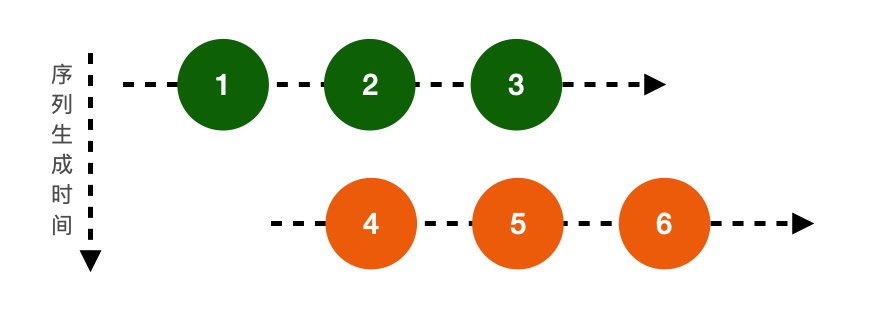
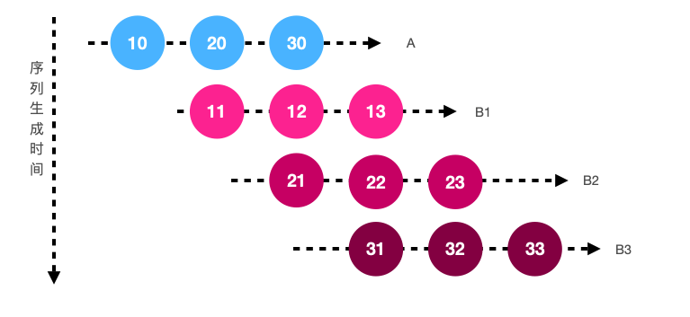

# 常用操作符

## 创建序列

### create

通过函数构建一个序列，在函数中描述next、error、complete的产生

```swift
Observable<Int>.create { (observer) -> Disposable in
    observer.onNext(1)
    observer.onNext(2)
    observer.onCompleted()
    return Disposables.create()
}
.subscribe(onNext: { print($0) })
.disposed(by: bag)
```


## 转换

### map

通过一个操作函数，将原序列的每个元素都转换成新元素，组成新的序列后输出

```swift
Observable.of(1, 2, 3)
    .map{ $0 * 10 }
    .subscribe(onNext: { print($0) })
    .disposed(by: bag)
```

### flatMap

将原序列的每个元素转换成一个序列，再将这些序列的元素合并之后组成新的序列输出

在flatMap中生成的序列有先后顺序，每生成一个序列就按照时间线发出这个序列的一个元素，依次循环，直到所有序列的元素发送完成为止

```swift
let stream1 = Observable.of(1, 2, 3)
let stream2 = Observable.of(4, 5, 6)
Observable.of(stream1, stream2)
    .flatMap{$0}
		// <===> 等价
    //.flatMap{ stream -> Observable<Int> in
    //    return stream
    //}
    .subscribe(onNext: { print($0) })
    .disposed(by: bag)

// 1 2 4 3 5 6
```

> 为什么不是 1 2 3 4 5 6 的顺序？

上面的代码中，原序列中有两个元素，每个元素本身就是一个序列，通过flatMap转换直接返回这两个序列。在第一次进入到flatMap闭包时，返回的是stream1，此时stream1已经开始发出第一个元素1，随后第二次进入到闭包体，在返回stream2之前，stream1的元素还没有发出完，继续发送元素2，闭包体再返回stream2，stream2开始发送元素第一个元素4。此时所有的序列已经生成完了，但是每个序列的元素还没有发出完，stream1还有最后一个元素3，stream2还有两个元素5和6，按照序列生成顺序依次发送，直到所有序列发送完，所以最终结果为1，2，4，3，5，6



另一个例子

```swift
let streamA = Observable.of(10, 20, 30)
let streamB: ((Int) -> Observable<Int>) = { n in
    print("(\(n))")
    return Observable.of(n+1, n+2, n+3)
}

streamA
    .flatMap{ streamB($0) }
    .subscribe(onNext: { print($0) })
    .disposed(by: bag)
```

streamA原序列有三个元素，在flatMap每个streamA的元素中通过streamB生成新的序列，为方便查看flatMap的执行顺序，再streamB中打印入参

flatMap首先转换streamA的第一个元素，打印(10)，随后生成一个新序列记为B1（11，12，13），B1立即发送他的元素11，之后flatMap转换streamA的第二个元素，打印(20)，生成一个新的序列B2（21，22，23），在按照序列生成顺序发送剩余元素，B1发送12，B2发送第一个元素21，再进行第三轮循环，取出streamA的最后一个元素，打印(30)，生成B3（31，32，33），再按照序列生成的顺序，B1发送它最后一个元素13，B2发送第二个元素22，B3的第一个元素31，此时所有序列都生成完了，但是B2，B3还有元素没有发送完，依次发送完毕，所以最后的结果是(10)、11、(20)、12、21、(30)、13、22、31、23、32、33，删除掉调试打印的streamA

```swift
11 12 21 13 22 31 23 32 33
```

序列时间线如下：



参考[理解rxjs中的flatMap, flatMapLatest](https://zhuanlan.zhihu.com/p/25607438)

### flatMapLatest

将原序列的每个元素转换成一个序列，再将这些序列中最新的一个发出，原理和flatMap一样，不同在于当生成一个新序列时，之前序列未发送的元素被忽略掉

```swift
let stream1 = Observable.of(1, 2, 3)
let stream2 = Observable.of(4, 5, 6)
Observable.of(stream1, stream2)
    .flatMapLatest{ $0 }
    .subscribe(onNext: { print($0) })
    .disposed(by: bag)
```

闭包生成stream2时就是最新的序列，生成stream2之前，stream1已经发出了他的第一个元素，忽略掉stream1的剩余元素，所以结果为

```swift
1 4 5 6
```

另一个例子

```swift
let streamA = Observable.of(10, 20, 30)
let streamB: ((Int) -> Observable<Int>) = { n in
    return Observable.of(n+1, n+2, n+3)
}
streamA
    .flatMapLatest{ streamB($0) }
    .subscribe(onNext: { print($0) })
    .disposed(by: bag)
```

第一轮，生成B1，发送B1的第一个元素11。第二轮生成B2，B1的剩余元素被忽略，发送B2第一个元素21。第三轮生成B3，B2的剩余元素被忽略，发出B3序列直到结束

```swift
11 21 31 32 33
```

### flatMapFirst

同flatMapLatest相反，当生成第一个序列时直接返回这个序列，转换结束

```swift
let stream1 = Observable.of(1, 2, 3)
let stream2 = Observable.of(4, 5, 6)
Observable.of(stream1, stream2)
    .flatMapFirst{ $0 }
    .subscribe(onNext: { print($0) })
    .disposed(by: bag)
// 1 2 3

let streamA = Observable.of(10, 20, 30)
let streamB: ((Int) -> Observable<Int>) = { n in
    let d = Observable.of(n+1, n+2, n+3)
    print("(\(n))")
    return d
}
streamA
    .flatMapFirst{ streamB($0) }
    .subscribe(onNext: { print($0) })
    .disposed(by: bag)
// 11 12 13
```

## 过滤

### take

仅仅从序列开始发送n个元素，忽略后面的元素

```swift
Observable.of(1, 2, 3, 4)
    .take(2)
    .subscribe(onNext: { print($0) })
    .disposed(by: bag)
// 1 2
```

