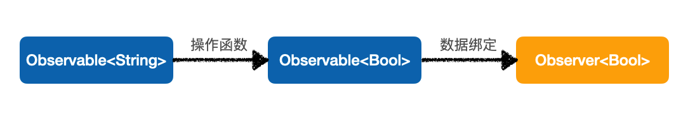

# RxSwift核心

## 函数响应式编程

函数响应式是一种编程范式，通过构建函数操作序列，对这些序列做出响应的编程方式，他结合了函数式编程和响应式编程



## Observable可监听序列

**Observable**可监听序列，描述元素异步产生的序列

```swift
Observable<Int>.create { (observer) -> Disposable in
    observer.onNext(1)
    observer.onNext(2)
    observer.onNext(3)
    observer.onError(RxNoteError.completeError)
    observer.onCompleted()
    return Disposables.create()
}
```

### Event事件

- next(ele)：产生一个元素
- error(Error)：生成序列时，产生一个错误，序列终止
- complete：所有序列元素都已经产生，序列完成

### Single

**Single**是另一个Observable版本，要么序列中只含有1个事件，要么发出error事件

> 不会共享附加作用

```swift
// single其实是Result<Element, Error>类型
let jsonObj = Single<[String: Any]>.create { (single) -> Disposable in
    let task = URLSession.shared.dataTask(with: url) { (data, response, error) in
        // 请求失败，产生一个error事件
        if let err = error {
            single(.failure(err))
            return
        }
        // 解析失败，产生一个error事件
        guard let data = data, let jsonObj = try? JSONSerialization.jsonObject(with: data, options: .mutableLeaves) as? [String: Any] else {
            single(.failure(RxNoteError.cantParseJSON))
            return
        }
        // 解析成功，发送一个成功事件
        single(.success(jsonObj))
    }
    task.resume()
    // 如果绑定被销毁时，取消请求
    return Disposables.create {
        task.cancel()
    }
}

// 订阅Single事件
jsonObj
// 发生错误3s后重试
.retry(when: { (error) -> Observable<Int> in
    return Observable.timer(.seconds(3), scheduler: MainScheduler.instance)
}).subscribe { (json) in
    print("获取到json：\(json)")
} onFailure: { (error) in
    print("获取json失败：\(error)")
} onDisposed: {
    print("已解绑")
}.disposed(by: bag)
```

> 当Observable序列只有一个元素时，可以使用`.asSingle()`方法，将其转换为Single序列

### Completable

**Completable**是另一个Observable版本，不能发出序列元素，要么只产生`completed`事件

> 不共享附加作用

```swift
// 生成Completable序列
let completavleObservable = Completable.create { (completable) -> Disposable in
    let arcValue = arc4random()%2 == 1
    if arcValue {
        completable(.completed)
    } else {
        completable(.error(RxNoteError.completeError))
    }
    return Disposables.create()
}

// 订阅Completabl序列
completavleObservable.subscribe {
    print("complete")
} onError: { (error) in
    print("error: \(error)")
}.disposed(by: bag)
```

### Maybe

**Maybe**也是另一个Observable版本，要么发出一个元素，要么发出一个`complete`事件，要么产生一个`error`事件，相当于其结果介于**Single**和**Completable**事件的序列

> 不会添加附加作用

```swift
// 生成maybe序列
let maybeObservable = Maybe<String>.create { (maybe) -> Disposable in
    let arcValue = arc4random()%2
    if arcValue == 0 {
        maybe(.success("MayBe Success"))
    } else if arcValue == 1 {
        maybe(.completed)
    } else {
        maybe(.error(RxNoteError.maybeError))
    }
    return Disposables.create()
}
// 订阅maybe序列
maybeObservable.subscribe { (success) in
    print(success)
} onError: { (error) in
    print(error)
} onCompleted: {
    print("maybe success")
}.disposed(by: bag)
```

### Driver

如果一个序列具有以下特征，就是一个**Driver**序列

- 不会产生error事件
- 只能在主线程订阅
- 可以共享附加作用

> 根据其特征，该序列可以用来驱动UI事件

```swift
// 普通序列转化为driver
let results = searchField.rx.text.orEmpty.asDriver()
    // 节流，0.3s内重复产生的序列会覆盖上次产生的序列
    .throttle(.milliseconds(300))
    .flatMapLatest { query in
        self.fetchAutoCompleteItems(query)
                    // 发生错误时提供备选返回值
            .asDriver(onErrorJustReturn: [])
    }
// 绑定显示序列数量
results
    .map{"\($0.count) count result"}
    .drive(countLabel.rx.text)
    .disposed(by: bag)
// table显示
results
    .drive(tableView.rx.items(cellIdentifier: GithubRepoCell.reuseID))
    { _, value, cell in
        cell.textLabel?.text = value
    }
    .disposed(by: bag)
```

> drive方法只能被Driver序列调用

### Signal

**Signal**和**Dirver**相似，不同在于**Dirver**会对观察者重新发送上一个元素，而Signal不会对观察者回放上一个元素

```swift
let event: Signal<Void> = button.rx.tap.asSignal()

let observer: () -> Void = { showAlert("弹出提示框1") }
event.emit(onNext: observer)

// ... 假设以下代码是在用户点击 button 后运行
let newObserver: () -> Void = { showAlert("弹出提示框2") }
event.emit(onNext: newObserver)
```

**Signal**不会把上一次的点击事件回放给新观察者，而只会将订阅后产生的点击事件，发布给新观察者

> 一般情况下状态序列会用Diver类型，事件序列选用Signal类型

## 观察者

观察者用于监听事件，对事件作出响应，响应事件的都是观察者。对于一个`UIView`，`isHidden`就是一个观察者，同理对于`UIButton`，`isEnabled`就是一个观察者。在订阅方法中，`onNext`、`onError`、`onComplete`这些闭包构造的方法都是观察者

观察者也可以通过**AnyObserver**和**Binder**创建

### AnyObserver

**AnyObserver**用来描述任意一种观察者

```swift
// 网络请求
URLSession.shared.rx.data(request: URLRequest(url: url))
    .subscribe { (data) in
        print(String.init(data: data, encoding: .utf8) ?? "\(data)")
    } onError: { (error) in
        print("data task error: \(error)")
    } onCompleted: {
        print("data task complete")
    }.disposed(by: bag)
// 等价于
// <=============>
let observer: AnyObserver<Data> = AnyObserver.init { (event) in
    switch event {
    case .next(let data):
        print(String.init(data: data, encoding: .utf8) ?? "\(data)")
    case .error(let error):
        print("data task error: \(error)")
    case .completed:
        print("data task complete")
    }
}
URLSession.shared.rx.data(request: URLRequest.init(url: url))
    .subscribe(observer)
    .disposed(by: bag)
```

### Binder

**Binder**具有以下两个特征的观察者

- 不会处理错误事件

- 确保绑定都是在Scheduler上执行（默认MainScheduler）

一般情况下，UI观察者不会出现错误事件，只会处理`next`事件，而且UI的更新都是在主线程上执行

所以放在**Binder**上更合理

```swift
let button = UIButton.init()
let observable = Observable<Bool>.create { (o) -> Disposable in
    o.onNext(true)
    o.onCompleted()
    return Disposables.create()
}
observable
    .bind(to: button.rx.isEnabled)
    .disposed(by: bag)
// 等价
// <=========>
let enableObserver = Binder.init(button) { (btn, value) in
    btn.isEnabled = value
}
observable
    .subscribe(enableObserver)
    .disposed(by: bag)
```

## Observable & Observer

有的序列既可以是可监听序列**Observable**可以是观察者**Observer**，比如`UITextField`的`text`属性、`UISwitch`开关状态、`segmentedControl`的选中索引号及`datePicker`的选中日期等。

还有一些辅助类型，即时可监听序列也是观察者

### AsyncSubject

**AsyncSubject**将在源**Observable**产生完事件后，只发出最后一个事件，如果源**Observable**

没有任何元素，只有一个完成事件，**AsyncSubject**也只有一个完成事件，如果源序列产生一个`error`

事件而终止，**AsyncSubject**不会发出任何事件，而是发出`error`事件后终止

```swift
// 只会发出完成事件之前的最后一个元素
let subject = AsyncSubject<String>.init()
subject.subscribe { (str) in
    print(str)
} onError: { (errpr) in
    print(errpr)
} onCompleted: {
    print("subject complete")
}.disposed(by: bag)

subject.onNext("🐷")
// 如果序列中有error，就会发出error
// subject.onError(RxNoteError.asyncSubjectError)
subject.onNext("🐔")
subject.onCompleted()

// 结果
🐔
subject complete
```

### PublishSubject

**PublishSubject**只会对观察者发出订阅后产生的事件，如果源**Observable**产生错误事件，那么观察者会接收到该错误之前添加订阅之后的所有事件，包括`error`事件

```swift
// 对订阅者发出订阅后的元素
let subject = PublishSubject<String>.init()
subject.onNext("🐷")
subject.onNext("🐂")
// 添加订阅
subject.subscribe { (event) in
    switch event {
    case .next(let str):
        print(str)
    case .error(let error):
        print(error)
    case .completed:
        print("publish subject complete")
    }
}.disposed(by: bag)
subject.onNext("🐑")
subject.onNext("🐎")
// 如果有错误事件，发出错误事件后终止
subject.onError(RxNoteError.anyObserverError)
subject.onNext("🐭")
subject.onCompleted()

// 结果
🐑
🐎
anyObserverError
```

### ReplaySubject

**ReplaySubject**可以将所有元素（buffersize指定数量）发送给观察者，不论观察者合适进行订阅

```swift
// buffersize指定添加观察之前添加监听的元素数量
let subject = ReplaySubject<String>.create(bufferSize: 1)
subject.onNext("🐷")
subject.onNext("🐂")

// 添加订阅
subject.subscribe { (event) in
    switch event {
    case .next(let str):
        print(str)
    case .error(let error):
        print(error)
    case .completed:
        print("publish subject complete")
    }
}.disposed(by: bag)

subject.onNext("🐑")
subject.onNext("🐎")
// 如果有错误事件，发出错误事件后终止
// subject.onError(RxNoteError.anyObserverError)
subject.onCompleted()

// 结果
🐷
🐂
🐑
🐎
publish subject complete
```

### BehaviorSubject

观察者对**BehaviorSubject**序列进行订阅时，他会将源**Observable**中最新的元素发送出来，如果没有最新元素，就会发送默认的元素，随后正常发送元素

```swift
let subject = BehaviorSubject<String>.init(value: "㊗️")
// 添加订阅
subject.subscribe { (event) in
    switch event {
    case .next(let str):
        print(str)
    case .error(let error):
        print(error)
    case .completed:
        print("publish subject complete")
    }
}.disposed(by: bag)

subject.onNext("🐑")
// 如果有错误事件，发出错误事件后终止
// subject.onError(RxNoteError.anyObserverError)
subject.onNext("🐭")
subject.onCompleted()

// 结果
㊗️
🐑
🐭
publish subject complete
```

## Schedulers

**Schedulers**是Rx实现多线程核心，主要控制任务在那个线程或队列运行。比如数据请求放在后台线程执行，显示请求结果放在主线程执行

- `subscribeOn`：决定序列数据的构建在那个Scheduler上执行
- `observeOn`：决定序列在那个Scheduler上监听
- `MainScheduler`：主线程
- `SerialDispatchQueueScheduler`：串行队列
- `ConcurrentDispatchQueueScheduler`：并行队列
- `OperationQueueScheduler`：OperationQueue的抽象，可以设置最大并发数maxConcurrentOperationCount

```swift
// 全局队列读取数据，主线程使用数据
DispatchQueue.global().async(qos: .userInitiated) {
    guard let data = try? Data.init(contentsOf: url) else {
        print("error read data")
        return
    }
    DispatchQueue.main.async {
        print(data)
    }
}
// ---------->
let rxData = Single<Data>.create { (signle) -> Disposable in
    guard let data = try? Data.init(contentsOf: url) else {
        signle(.failure(RxNoteError.maybeError))
        return Disposables.create()
    }
    signle(.success(data))
    return Disposables.create()
}
rxData
    // 决定数据序列的构建函数在哪个 Scheduler 上运行
    .subscribe(on: ConcurrentDispatchQueueScheduler.init(qos: .userInitiated))
    // 在那个Scheduler上监听数据
    .observe(on: MainScheduler.instance)
    .subscribe { (data) in
        print(data)
    } onFailure: { (error) in
        print(error)
    }.disposed(by: bag)
```

## 错误处理

当产生序列发生错误时，序列就会终止，并发出错误事件，此时有两种处理方式

### retry

发生错误时重试，可以指定重试次数

### retryWhen

可以指定重试的时机

```swift
// 发生错误3s后重试
jsonObj.retry(when: { (error) -> Observable<Int> in
    return Observable.timer(.seconds(3), scheduler: MainScheduler.instance)
}).subscribe { (json) in
    print("获取到json：\(json)")
} onFailure: { (error) in
    print("获取json失败：\(error)")
} onDisposed: {
    print("已解绑")
```

