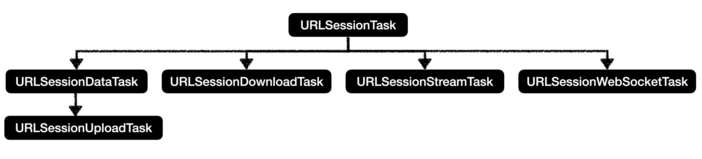

# URLSession

URLSession是iOS7之后用以和服务器交互数据的集合类和协议的统称，它可以实现数据请求，后台上传，下载等功能，可以通过闭包实现回调事件，也可以通过代理实现重定向和任务完成的事件等

每个程序可以创建多个URLSession实例，每个实例用以组织相关的数据传输任务

URLSession由三部分构成：

- URLSessionConfiguration：会话的初始化配置，可以设置会话的可用网络类型，与主机的最大连接数，缓存策略，安全证书等

- URLSession：负责请求/响应数据交互的会话对象
- URLSessionTask：会话任务的基类，通过调用会话的创建不同类型任务的方法来创建任务

## URLSessionConfiguration

使用URLSessionConfiguration初始化会话时，URLSession对象回复制配置对象，之后对配置对象的任何修改都是无效的，除非使用修改后的配置重新初始化URLSession

### 创建

URLSessionConfiguration有三种创建方法

- default
- ephemeral
- background

```swift
/// default方法
let config = URLSessionConfiguration.default
```

default类对象创建，这个属性创建了默认的会话配置，注意不是单例对象，所以使用default创建的会话配置不会共享cookie、缓存等，每个会话配置都要单独设置这些内容

default会话配置使用基于磁盘的持久缓存（将结果下载到文件时除外），并将凭据存储在用户的钥匙串中。 它还将cookie（默认情况下）存储在与NSURLConnection和NSURLDownload类相同的共享cookie存储中

```swift
/// 临时方法
let config = URLSessionConfiguration.ephemeral
```

ephemeral创建的会话配置对象是临时的，它不对缓存，cookie或凭据使用任何持久性存储，而是将这些信息保存在内存中，以保证数据请求的安全性。ephemeral也不是单例，而是一个类属性

```swift
/// 使用标识符创建
let config3 = URLSessionConfiguration.background(withIdentifier: "download.sessionconfig")
```

该方法创建的会话配置允许在后台执行下载或上传任务，使用此对象配置的会话会将传输的控制权移交给系统，该系统在单独的进程中处理传输。即使应用本身已处于非活跃状态，此配置也可以使传输继续进行，当应用重新处于活跃状态时，使用相同的标识符创建新的会话配置和会话，检索终止时正在进行的传输任务，即可查看任务

### 配置内容

#### 基础配置

- identifier：唯一标识

```swift
var identifier: String?
```

- httpAdditionalHeaders：会话任务的请求头

```swift
var httpAdditionalHeaders: [AnyHashable : Any]?
```

- networkServiceType：网络服务类型，用于向系统提供流量用途提示，该提示决定系统使用流量的决策，是否使用蜂窝网络还是wifi网络等，以节省流量，平衡性能。例如当进行下载任务时，指定网络类型为**background**，默认值为**default**

```swift
var networkServiceType: NSURLRequest.NetworkServiceType
```

- allowsCellularAccess：是否允许使用蜂窝网路

- timeoutIntervalForRequest：设置session请求间的超时时间，这个超时时间并不是请求从开始到结束的时间，而是两个数据包之间的时间间隔。当任意请求返回后这个值将会被重置，如果在超时时间内未返回则超时。单位为秒，默认为60秒
- timeoutIntervalForResource：请求资源等待的最长时间，在上传和下载任务中，如果该时间内任务没有结束，就放弃之前传输的内容，单位为秒，默认7天
- sharedContainerIdentifier: 后台URL会话中的文件应下载到的共享容器的标识符

#### cookie策略

- httpCookieAcceptPolicy：何时接受cookie

```swift
var httpCookieAcceptPolicy: HTTPCookie.AcceptPolicy
```

- httpShouldSetCookies：确定请求是否应包含来自cookie存储区的cookie
- httpCookieStorage：cookie存储区，用于在会话中存储cookie，要禁用cookie存储设置为nil。对于默认会话和后台会话，默认值为共享cookie存储对象。对于临时会话，默认值为私有cookie存储对象，该对象仅将数据存储在内存中，并且在使会话无效时会被销毁

```swift
var httpCookieStorage: HTTPCookieStorage?
```

#### 安全策略

- tlsMinimumSupportedProtocolVersion：会话建立连接时应接受的最低TLS协议版本

```swift
var tlsMinimumSupportedProtocolVersion: tls_protocol_version_t
```

- tlsMaximumSupportedProtocolVersion：会话建立连接时应接受的最高TLS协议版本

```swift
var tlsMaximumSupportedProtocolVersion: tls_protocol_version_t
```

- urlCredentialStorage：提供用于身份验证的凭据的凭据存储，不使用凭据存储设置为nil。对于默认会话和后台会话，默认值为共享凭据存储对象。对于临时会话，默认值是一个专用凭据存储对象，该对象仅将数据存储在内存中，并且在使会话无效时会被销毁

```swift
var urlCredentialStorage: URLCredentialStorage?
```

#### 缓存策略

- urlCache：为会话中的请求提供缓存的响应，禁用缓存设置为nil。对于默认会话，默认值为共享URL缓存对象。对于后台会话，默认值为nil。对于临时会话，默认值是专用缓存对象，该对象仅将数据存储在内存中，并且在使会话无效时会被销毁

```swift
var urlCache: URLCache?
```

- requestCachePolicy：会话中的任务使用的请求缓存策略

```swift
var requestCachePolicy: NSURLRequest.CachePolicy
```

#### 后台传输

- sessionSendsLaunchEvents：标识任务传输完成后应在后台恢复还是启动该应用
- isDiscretionary：标识是否可以由系统决定是否调度后台任务以实现最佳性能
- shouldUseExtendedBackgroundIdleMode：标识当程序在后台时是否应保持TCP连接打开

#### 多路径TCP

- multipathServiceType：指定用于通过Wi-Fi和蜂窝网络传输数据的多路径TCP连接策略

```swift
var multipathServiceType: URLSessionConfiguration.MultipathServiceType
```

#### HTTP策略与代理

- httpMaximumConnectionsPerHost：到给定主机的最大同时连接数，iOS默认4
- httpShouldUsePipelining：确定会话是否使用**HTTP pipelining**，可以显著减少请求时间，默认false
- connectionProxyDictionary：会话中使用的代理的信息

#### 连接更改

- waitsForConnectivity：标识会话是应该等待连接变为可用还是立即失败。例如当使用蜂窝网络信号差导致丢失连接时，是否应该等待连接恢复还是立刻返回连接失败

#### 连接受限

- allowConstrainedNetworkAccess：标识使用低数据模式时是否可以使用网络
- allowExpensiveNetworkAccess：标识是否使用需要资费的网络连接，如蜂窝网络和个人热点

## URLSession

URLSession本身不负责数据的请求，而是通过创建Task任务，Task来请求的方式处理会话

### 创建

URLSession有三种创建方式

```swift
/// 使用系统提供的共享单例对象
let sessionShared = URLSession.shared
```

共享单例对象使用的默认配置选项，所以有很多的使用限制

- 不能从服务器获取增量数据
- 不能更改默认的连接行为
- 身份验证受限
- 当app没有运行时，不能使用后台上传和下载功能

```swift
/// 使用URLSessionConfiguration初始化URLSession
let sessionConfiguration = URLSessionConfiguration.default
let session = URLSession.init(configuration: sessionConfiguration)
```

URLSessionConfiguration可以配置请求的超时时间、请求头、cookie和鉴权等信息

```swift
/// 指定委托和回调队列
let session = URLSession.init(configuration: sessionConfiguration, delegate: self, delegateQueue: .current)
```

此方法可以设置会话的初始化信息，委托对象，委托回调队列等

- delegate：通知代理对象会话的生命周期，处理身份验证
- delegateQueue：回调队列用于调度委托调用和完成处理程序的操作队列，该队列应该是一个串行队列，以确保回调的正确顺序，如果为nil，则会话将创建一个串行操作队列

### 管理会话

- 结束所有未完成的任务并使会话失效

```swift
func finishTasksAndInvalidate()
```

- 将cookie和凭据保存到磁盘，清除临时缓存，并确保将来的请求在新的TCP连接上发生

```swift
func flush(completionHandler: () -> Void)
```

- 异步调用会话中的所有数据，上载和下载任务的完成回调

```swift
func getTasksWithCompletionHandler(([URLSessionDataTask], [URLSessionUploadTask], [URLSessionDownloadTask]) -> Void)
```

- 异步调用会话中所有任务的完成回调

```swift
func getAllTasks(completionHandler: ([URLSessionTask]) -> Void)
```

- 取消所有未完成的任务，并使会话失效

```swift
func invalidateAndCancel()
```

- 清空所有cookie，缓存和凭据存储，删除磁盘文件，将正在进行的下载存储到磁盘，并确保将来的请求在新的socket上发生

```swift
func reset(completionHandler: () -> Void)
```

- sessionDescription：会话描述

### URLSessionDelegate

会话通过代理来在各种事件发生时提供和获取信息，包括以下情况：

- 会话状态

```swift
func urlSession(URLSession, didBecomeInvalidWithError: Error?)
```

- 数据从服务器发出

```swift
func urlSessionDidFinishEvents(forBackgroundURLSession: URLSession)
```

- 请求身份验证

```swift
func urlSession(URLSession, didReceive: URLAuthenticationChallenge, completionHandler: (URLSession.AuthChallengeDisposition, URLCredential?) -> Void)
```

> 初始化URLSession并设置代理后，会话对象一直保持着对代理对象的强引用，如果调用finishTasksAndInvalidate方法或者invalidateAndCancel方法会断开强引用，此时session就不可再使用，即只有当session无效时才会接触强引用关系

### URLSessionTaskDelegate

URLSession处理会话任务的协议，继承自URLSessionDelegate，其中定义了处理任务级事件的方法，包括：

- 任务传输结果

```swift
func urlSession(URLSession, task: URLSessionTask, didCompleteWithError: Error?)
```

- 重定向处理

```swift
func urlSession(URLSession, task: URLSessionTask, willPerformHTTPRedirection: HTTPURLResponse, newRequest: URLRequest, completionHandler: (URLRequest?) -> Void)
```

- 上传任务处理

```swift
// 数据发送进度
func urlSession(URLSession, task: URLSessionTask, didSendBodyData: Int64, totalBytesSent: Int64, totalBytesExpectedToSend: Int64)
// 任务需要新的请求体
func urlSession(URLSession, task: URLSessionTask, needNewBodyStream: (InputStream?) -> Void)
```

- 身份认证

```swift
func urlSession(URLSession, task: URLSessionTask, didReceive: URLAuthenticationChallenge, completionHandler: (URLSession.AuthChallengeDisposition, URLCredential?) -> Void)
```

- 任务延迟和等待处理

``` swift
// 开始加载延迟的会话任务
func urlSession(URLSession, task: URLSessionTask, willBeginDelayedRequest: URLRequest, completionHandler: (URLSession.DelayedRequestDisposition, URLRequest?) -> Void)
// 任务正在等待，直到有可用的网络连接，参考urlSessionConfig的waitsForConnectivity属性
func urlSession(URLSession, taskIsWaitingForConnectivity: URLSessionTask)
```

- 任务指标对象，统计通能，记录与服务器交互每个步骤的时间节点和信息

```swift
func urlSession(URLSession, task: URLSessionTask, didFinishCollecting: URLSessionTaskMetrics)
```

当会话创建不同类型的任务时，每种任务都各自的协议，具体有以下类型：

- URLSessionDataDelegate：处理数据和上传任务
- URLSessionDownloadDelegate：处理下载任务，例如下载进度
- URLSessionStreamDelegate：处理流任务
- URLSessionWebSocketDelegate：处理WebSocket任务

这些协议都继承自URLSessionTaskDelegate，用以处理具体类型的会话任务

## URLSessionTask

URLSessionTask是所有任务的父类，其中定义了操作任务的基本方法，包括开始、暂停获取任务进度等。通过对URLSession实例调用创建任务的方法来创建任务，不同的方法创建的任务类型也不同，所有任务分为一下几种类型：

- URLSessionDataTask：任务下载的数据直接返回在内存中，返回数据的格式是Data
- URLSessionUploadTask：数据上传任务，继承自URLSessionDataTask
- URLSessionDownloadTask：任务下载的数据存储在文件中
- URLSessionStreamTask：数据流任务
- URLSessionWebSocketTask：通过WebSockets协议标准进行通信的URL会话任务

任务之间的继承结构如下：



### 方法和属性

#### 状态控制

- cancel：取消任务方法
- resume：如果任务被挂起，继续执行任务
- suspend：挂起任务
- state：任务状态，活动，暂停，正在取消或完成的过程
  - running：任务正在进行
  - suspended：任务暂停
  - canceling：任务取消
  - completed：任务已经完成

```swift
var state: URLSessionTask.State
```

#### 任务进度

- priority：优先级，0-1，该属性不代表请求的优先级，而是一个标示
- progress：总体任务进度
- countOfBytesExpectedToReceive：任务总的接收字节数
- countOfBytesReceived：任务已经接收的字节数
- countOfBytesExpectedToSend：任务总的发送的总字节数
- countOfBytesSent: 任务已经发送的字节数
- NSURLSessionTransferSizeUnknown：无法确定传输的总大小

#### 任务信息

- currentRequest：任务当前正在处理的请求对象，发生重定向时，表示重定向后的请求对象

```swift
var currentRequest：URLRequest？
```

- originalRequest：原始请求对象

```swift
var originalRequest：URLRequest？
```

- response：服务器对当前任务请求的响应

```swift
var response: URLResponse?
```

- taskDescription：任务描述
- taskIdentifier：唯一标识
- error：任务失败的原因