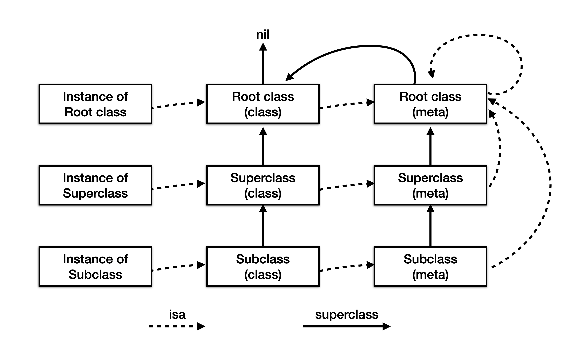

## Runtime

### 1. isa指向和作用

isa指针是用来维护实例对象和类对象之间的关系，确保实例对象和类对象能够通过isa指针找对对应的成员变量、成员方法和协议规则

在isa的实现中，并不是直接指向对象的类型，isa是一个联合体类型isa_t，其中的bits属性存储了诸多信息：

- nonpointer：0 标识普通指针，存储了class metaclass对象的地址，1 代表优化过，使用位域存储更多信息
- has_assoc：对象是否有或曾有关联引用，没有关联引用可以更快的释放
- has_cxx_dtor：是否有C++析构函数或OC析构函数
- shiftcls：对象指向类的内存地址，也就是isa指向的地址
- uintptr_t magic：对象是否初始化完成
- weakly_referenced : 是否被若引用或被弱引用过
- uintptr_t deallocating：正在释放
- uintptr_t has_sidetable_rc  : 对象引用计数太大，是否超出存储区域
- uintptr_t extra_rc：对象引用计数

shiftcls就是保存对象指向类的信息，通过位运算得到类对象



1. Root class(class)就是NSObject，它没有父类，所以NSObject的superclass指向nil
2. 每个Class都有一个isa指针指向唯一的Mate class
3. Root class（meta）的superclass指向Root class（class），也就是NSObject，形成一个回路
4. 每个Meta Class的isa都指向Root class（meta）

### 2. 一个NSObject占用的内存空间大小

NSObject实际上是一个结构体，内部只存储了一个isa指针，占用8字节大小。但是实际上在分配内存时，以16字节分配，为了提高内存访问效率

```swift
/// 获取内存大小
sizeof(object)	// 8
class_getInstanceSize([object class]) // 8
/// 获取实际内存占用大小
malloc_size(object) // 16
```

### 3. class_rw_t和class_ro_t

class_ro_t是在编译器就已经确定了类的属性，方法和实现的协议，没有存储分类方法。ro就是read only，标识无法修改的

class_rw_t是在运行时生成的，在编译期间，class_ro_t结构体就已经确定，objc_class中的bits的data部分存放着该结构体的地址。在runtime运行之后，具体说来是在运行runtime的realizeClass 方法时，会生成class_rw_t结构体，该结构体包含了class_ro_t，并且更新data部分，换成class_rw_t结构体的地址

两个结构体的成员变量有很多相同的地方，他们都存放着当前类的属性、实例变量、方法、协议等等。区别在于：class_ro_t存放的是编译期间就确定的；而class_rw_t是在runtime时才确定，它会先将class_ro_t的内容拷贝过去，然后再将当前类的分类的这些属性、方法等拷贝到其中。所以可以说class_rw_t是class_ro_t的超集，当然实际访问类的方法、属性等也都是访问的class_rw_t中的内容


### 4. Runtime方法缓存的存储形式、数据结构和查找过程

使用cache_t增量扩展的哈希表结构存储方法缓存，哈希表内部存储的bucket_t，bucket_t存储sel和imp的键值对，在方法查找时：

- 如果时有序方法列表，采用二分法查找
- 如果是无序方法列表，直接遍历查找

### 5. 消息转发

方法的调用最终会被转换成objc_msgSend的调用，例如：

```objective-c
[per walk];
=>
objc_msgSend(per, @selector(walk));
```

objc_msgSend的执行流程如下：

1. 通过isa指针查找对象所属的类

2. 查找类的cache列表，如果没有则下一步

3. 查找类的方法列表

4. 如果找到了与方法选择器名称相同的方法，跳转至实现代码
5. 找不到，沿着继承体系一直向上查找，仍然是先查找cache列表，在查找方法列表
6. 找到了与方法选择名称相同的方法，就跳转至实现代码
7. 找不到，执行消息转发

如果执行的方法在继承体系中都没有查找到话，会执行消息转发流程消息转发流程如下：

1. 动态方法解析：通过+resolveInstanceMethod:方法询问接收者所属的类，能不能动态添加其他方法来处理这个未知消息，如果能，消息转发结束
2. 备用接收者：当动态方法解析不能处理时，通过-forwardingTargetForSelector：方法询问接收者有没有其他对象能处理这条消息，如果有，将该消息转发给能处理的其他对象，消息转发结束
3. 消息签名：当备用接收者也不能处理这条消息时，需要返回一个消息签名给后一步消息转发，如果返回nil，消息转发结束
4. 完整的消息转发：如果备用接收者也不能处理这条消息，就将消息的所有相关信息都封装到NSInvocation对象，再问一次接收者，是否能处理，如果不能处理，崩溃

下面的例子中，Man时Person的子类，代替Person实现run和walk方法，

```objective-c
Person * per = [Person new];
// 调用未实现的方法
[per walk];
[per run];
// 动态调用
[per performSelector:@selector(fly)];
```

Person实现，fly方法是动态调用的，动态添加该方法的实现

```objective-c
@implementation Person

// 消息转发流程
+ (BOOL)resolveInstanceMethod:(SEL)sel {
  	// 比较sel的方法名
    if (!strcmp("fly", sel_getName(sel))) {
        // 添加方法实现
        class_addMethod([self class], sel, (IMP)canNotFly, "v@:");
        return true;
    } else {
        return [super resolveInstanceMethod:sel];
    }
}

// 消息备用接收者
- (id)forwardingTargetForSelector:(SEL)aSelector {
    if (aSelector == @selector(walk) && [Man instancesRespondToSelector:aSelector]) {
        return [[Man alloc] init];
    }
    return [super forwardingTargetForSelector: aSelector];
}

// 当备用消息接收者为nil时，生成方法签名
- (NSMethodSignature *)methodSignatureForSelector:(SEL)aSelector {
    if (aSelector == @selector(run)) {
        // 为转发的方法手动生成签名
        // 签名类型就是用来描述这个方法的返回值、参数的
        // 方法签名默认隐藏两个参数
        // self代表方法调用者
        // _cmd代表这个方法的sel
        // v@:表示：v代表放回值void、@代表self，:代表_cmd
        return [NSMethodSignature signatureWithObjCTypes: "v@:"];
    }
    return [super methodSignatureForSelector:aSelector];
}

// 当动态方法解析和备用接收者都没有处理这个消息时，执行完整消息转发
- (void)forwardInvocation:(NSInvocation *)anInvocation {
    SEL selector = [anInvocation selector];
    if ([Man instancesRespondToSelector: selector]) {
        // 转发到Man对象实现
        [anInvocation invokeWithTarget:[Man new]];
    }
}

// fly的实现
void canNotFly(id self, SEL sel) {
    NSLog(@"%@ can not %@", self, NSStringFromSelector(sel));
}
```

### 6. self.class和super.class

self是类的隐藏参数，指向当前调用方法的类的实例本身，当查找方法时，self会先从自己的方法列表中查找，找不到再从父类开始找

super是一个编译器标识符，和self是同一个消息接收者。不同在与，super会告诉编译器查找方法时从父类的方法列表开始查找，而不是查找本类

