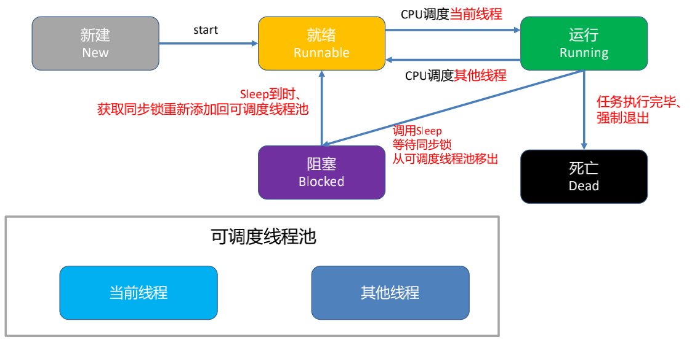
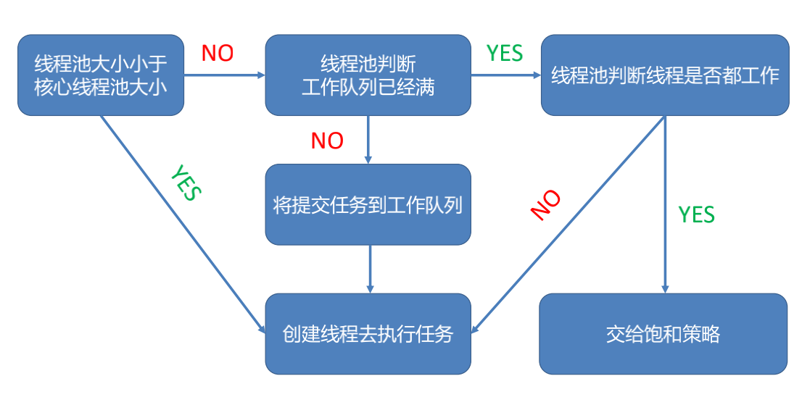

# 多线程理解

多线程即多个线程并发执行，提高任务处理的效率

## 进程、线程与队列

### 进程

**进程** 指正在运行的一个程序，是操作系统分配资源和调度的独立单位，当程序开始运行就变成一个进程。多个程序（进程）之间相互独立，并占用独立的内存空间

### 线程

**线程** 是进程的基本执行单元，负责当前线程任务的执行。一个进程至少有一个线程，程序开始执行默认有一个线程，即`主线程（UI线程）`

### 进程与线程的联系

- 内存：同一进程内的线程共享进程的内存空间，而进程之间相互独立，内存独立
- 资源：同一进程内的线程共享进程资源，如IO，cpu，进程之间资源独立
- 稳定性：当一个进程崩溃，进程之间独立保证其他进程不受影响，但是进程的某个线程崩溃，整个进程也会奔溃
- 线程时程序执行的最小单位，进程时操作系统分配资源的最小单位

- 调度和切换：线程上下文切换比进程上下文切换更快
- 线程不能独立运行，必须依存于进程

### 队列

**队列** 是一种特殊的线性表，只允许表的前端进行删除操作，后段进行插入操作，即遵循先进先出（FIFO）原则，队列可以通过数组或链表实现

### 队列与线程的关系

队列是调度任务的方法，线程是执行任务的载体

## 多线程

### 原理

同一时间，cpu只能执行一个线程的任务，多线程就是在一段时间内，cpu快速在多条线程中切换执行

### 优缺点

- 优点
  - 提高程序的执行效率
  - 提高系统资源利用率（cpu、内存）
- 缺点
  - 开启线程需要消耗一定的内存空间
  - 线程太多，cpu调度开销越大
  - 程序更复杂，如线程之间通讯、数据共享

### 生命周期

新建/就绪/运行/阻塞/死亡

- 新建：实例化线程对象
- 就绪：向线程对象发送start消息，线程对象被加入可调度线程池等待CPU调度
- 运行：CPU 负责调度可调度线程池中线程的执行，线程执行完成之前，状态可能会在就绪和运行之间来回切换。就绪和运行之间的状态变化由CPU负责，外部不可干预
- 阻塞：当满足某个预定条件时，可以使用休眠或锁，阻塞线程执行。`sleepForTimeInterval`（休眠指定时长），`sleepUntilDate`（休眠到指定日期），`@synchronized(self)：`（互斥锁）
- 死亡：线程任务执行完毕，正常死亡；非正常死亡，当满足某个条件后，在线程内部中止执行/在主线程中止线程对象

### 线程池原理

- 若`线程池大小`小于`核心线程池大小`时
  - 创建线程执行任务
- 若`线程池大小`大于等于`核心线程池大小`时
  1. 先判断线程池工作队列是否已满
  2. 若没满就将任务push进队列
  3. 若已满时，且`maximumPoolSize>corePoolSize`，将创建新的线程来执行任务
  4. 反之则交给`饱和策略`去处理

饱和策略有如下四个：

- AbortPolicy：直接抛出RejectedExecutionExeception异常来阻止系统正常运行
- CallerRunsPolicy：将任务回退到调用者
- DisOldestPolicy：丢掉等待最久的任务
- DisCardPolicy：直接丢弃任务

## 多线程实现

| 技术方案  | 简介                         | 生命周期 |
| --------- | ---------------------------- | -------- |
| pthread   | 通用多线程api，跨平台/可移植 | 手动     |
| NSThread  | 面向对象，直接操作线程对象   | 手动     |
| GCD       |                              | 自动     |
| Operation | GCD的封装                    | 自动     |

