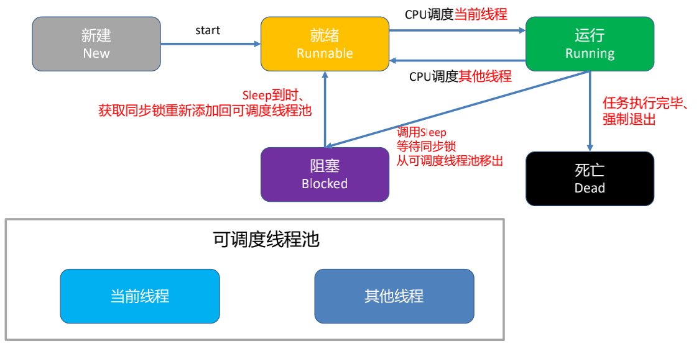
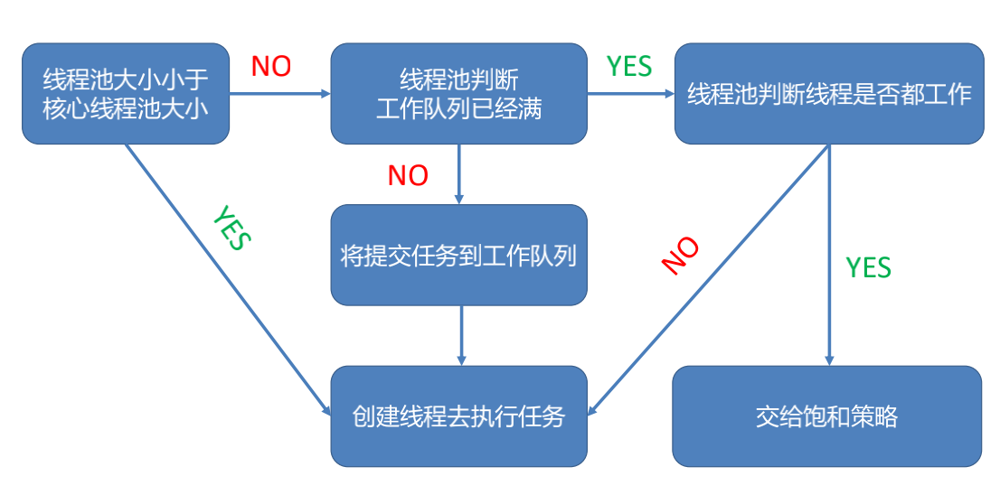

# 多线程理解

多线程即多个线程并发执行，提高任务处理的效率

## 进程、线程与队列

### 进程

**进程** 指正在运行的一个程序，是操作系统分配资源和调度的独立单位，当程序开始运行就变成一个进程。多个程序（进程）之间相互独立，并占用独立的内存空间

### 线程

**线程** 是进程的基本执行单元，负责当前线程任务的执行。一个进程至少有一个线程，程序开始执行默认有一个线程，即`主线程（UI线程）`

### 进程与线程的联系

- 内存：同一进程内的线程共享进程的内存空间，而进程之间相互独立，内存独立
- 资源：同一进程内的线程共享进程资源，如IO，cpu，进程之间资源独立
- 稳定性：当一个进程崩溃，进程之间独立保证其他进程不受影响，但是进程的某个线程崩溃，整个进程也会奔溃
- 线程时程序执行的最小单位，进程时操作系统分配资源的最小单位

- 调度和切换：线程上下文切换比进程上下文切换更快
- 线程不能独立运行，必须依存于进程

### 队列

多线程中的队列是指任务执行处理的等待队列，是一种特殊的线性表，只允许表的前端进行删除操作，后段进行插入操作，即遵循先进先出（FIFO）原则，队列可以通过数组或链表实现

#### 队列类型

- **串行队列**：任务按照插入顺序执行，上一个任务执行完成再执行下一个任务，指开启一个线程
- **并行队列**：多个任务可以同时执行，可以开启多个线程

> 主队列是一种特殊的串行队列
>
> 全局队列是并行队列

#### 队列执行任务的方式

- **同步执行**：同步添加任务到指定队列，在添加的任务结束之前，会一直等待，直到队列中的任务完成后再继续执行

  > 同步执行添加的任务只能在当前线程执行，不能开启新线程

- **异步执行**：异步添加任务到指定队列，不需要等待任务结束，不需要任何等待就能执行任务

  > 异步执行添加的任务可以创建新线程，但不一定会创建新线程

### 队列与线程的关系

队列是调度任务的方法，线程是执行任务的载体

## 多线程

### 原理

同一时间，cpu只能执行一个线程的任务，多线程就是在一段时间内，cpu快速在多条线程中切换执行

### 优缺点

- 优点
  - 提高程序的执行效率
  - 提高系统资源利用率（cpu、内存）
- 缺点
  - 开启线程需要消耗一定的内存空间
  - 线程太多，cpu调度开销越大
  - 程序更复杂，如线程之间通讯、数据共享

### 生命周期

新建/就绪/运行/阻塞/死亡

- 新建：实例化线程对象
- 就绪：向线程对象发送start消息，线程对象被加入可调度线程池等待CPU调度
- 运行：CPU 负责调度可调度线程池中线程的执行，线程执行完成之前，状态可能会在就绪和运行之间来回切换。就绪和运行之间的状态变化由CPU负责，外部不可干预
- 阻塞：当满足某个预定条件时，可以使用休眠或锁，阻塞线程执行。`sleepForTimeInterval`（休眠指定时长），`sleepUntilDate`（休眠到指定日期），`@synchronized(self)：`（互斥锁）
- 死亡：线程任务执行完毕，正常死亡；非正常死亡，当满足某个条件后，在线程内部中止执行/在主线程中止线程对象

### 线程池原理

- 若`线程池大小`小于`核心线程池大小`时
  - 创建线程执行任务
- 若`线程池大小`大于等于`核心线程池大小`时
  1. 先判断线程池工作队列是否已满
  2. 若没满就将任务push进队列
  3. 若已满时，且`maximumPoolSize>corePoolSize`，将创建新的线程来执行任务
  4. 反之则交给`饱和策略`去处理

饱和策略有如下四个：

- AbortPolicy：直接抛出RejectedExecutionExeception异常来阻止系统正常运行
- CallerRunsPolicy：将任务回退到调用者
- DisOldestPolicy：丢掉等待最久的任务
- DisCardPolicy：直接丢弃任务

## 多线程实现

- **pthread**：跨平台可移植的通用多线程api，由c语言编写，需要手动管理生命周期，使用难度较大
- **Thread**：面向对象的轻量级多线程方案，每一个Thread对象都是一个线程，同样需要手动管理生命周期
- **GCD**：Grand Central Dispatch，线程管理交由系统实现，开发时只要将任务添加到适当的队列，来提高程序在多核处理器上的效率
- **Operation**：对GCD的封装，面向对象，相交GCD简单易用，可读性更好。且增加了操作完成的代码块，操作之间的依赖关系，优先级，并发数，可以对操作进行KVO观察等功能

## 线程间通讯

- **直接消息传递**：通过`performSelector`的一系列方法，可以实现由某一线程指定在另外的线程上执行任务。因为任务的执行上下文是目标线程，这种方式发送的消息将会自动的被序列化
- **全局变量、共享内存块和对象**：在两个线程之间传递信息的另一种简单方法是使用全局变量，共享对象或共享内存块。尽管共享变量既快速又简单，但是它们比直接消息传递更脆弱。必须使用锁或其他同步机制仔细保护共享变量，以确保代码的正确性。 否则可能会导致竞争状况，数据损坏或崩溃
- **条件执行**：条件是一种同步工具，可用于控制线程何时执行代码的特定部分。您可以将条件视为关守，让线程仅在满足指定条件时运行
- **Runloop sources**： 一个自定义的 Runloop source 配置可以让一个线程上收到特定的应用程序消息。由于 Runloop source 是事件驱动的，因此在无事可做时，线程会自动进入睡眠状态，从而提高了线程的效率
- **Ports and sockets**：基于端口的通信是在两个线程之间进行通信的一种更为复杂的方法，但它也是一种非常可靠的技术。更重要的是，端口和套接字可用于与外部实体（例如其他进程和服务）进行通信。为了提高效率，使用 Runloop source 来实现端口，因此当端口上没有数据等待时，线程将进入睡眠状态
- **消息队列**：传统的多处理服务定义了先进先出（FIFO）队列抽象，用于管理传入和传出数据。尽管消息队列既简单又方便，但是它们不如其他一些通信技术高效
- **Cocoa 分布式对象**：分布式对象是一种 Cocoa 技术，可提供基于端口的通信的高级实现。尽管可以将这种技术用于线程间通信，但是强烈建议不要这样做，因为它会产生大量开销。分布式对象更适合与其他进程进行通信，尽管在这些进程之间进行事务的开销也很高

## 参考

[我是好宝宝](https://juejin.cn/post/6844904121468715015)

