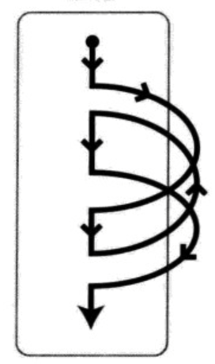
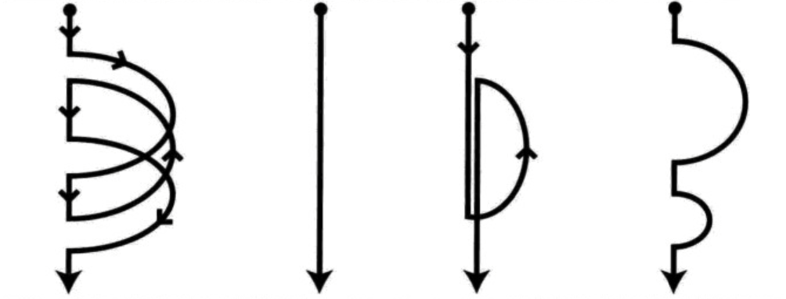

# GCD

**GCD**：Grand Central Dispatch异步执行任务的主要方式之一，GCD中线程管理任务交由系统实现，开发时只要将任务添加到适当的队列，GCD就能生成相应的线程去执行任务，由此提高任务处理在多核处理器上的效率

swift/Objective-C -> C/C++ -> 汇编 -> 机器码

当用户启动应用后，系统现将包含在应用内的CPU命令配置到内存中，CPU从程序指定的地址开始，一步一步执行CPU命令列，当遇到if或for等流程控制语句时，执行命令的地址会远离当前的地址（位置迁移），但是，因为一个CPU一次只能执行一个命令，不能执行某处分开的并列的两个命令，因此通过CPU执行的命令就如一条无分叉的路，其执行不会出现分歧

所以，一个CPU执行的CPU命令列为一条无分叉的路径 就是线程



现在的多核CPU中，实际上有不止一个CPU核心，如果将一个CPU核心虚拟为两个CPU核心工作，虚拟后每个核心`执行CPU命令列仍是一条无岔路的路径`的规则不变，此时无岔路的路径不止一条，同时存在多条就是多线程。在多线程中，每个CPU核心执行多条不同路径上的不同命令



## 任务和队列

任务和队列是GCD中两个核心的概念，任务是指GCD中需要执行的操作，也就是线程中执行的代码。队列是任务的组织形式，以FIFO的原则去执行任务，新追加的任务放到队列尾部，先执行最早添加的任务，完成之后继续执行下一个，直到所有任务执行结束

执行任务的方式有两种：同步执行和异步执行：

- 同步执行（sync）：新添加的任务等待上一个任务执行完毕才会执行
- 异步执行（async）：新添加的任务不等待其他任务执行结果，添加后就可以开始执行

GCD中的队列也有两种：串行队列和并行队列：

- 串行队列（serial）：每次只有一个任务被执行，所有任务一个接着一个按照添加顺序执行
- 并行队列（concurrent）：多个任务可以一起执行

## DispatchQueue

DispatchQueue就是GCD中的任务队列，程序以闭包的形式向队列提交任务，执行时以串行或并行的方式来执行任务，除了主线程之外，系统可能创建其他线程来执行任务

### 创建

在程序中，体统提供了两个队列：主队列和全局队列，主队列时一个特殊的串行队列，负责用户界面更新、触摸事件处理等任务。全局队列是一个并行队列，按照不同的优先级可以获取不同的全局队列。所以队列创建可以分为获取系统队列和创建自定义队列两部分

- 获取主队列

```swift
let mainQueue = DispatchQueue.main
```

- 获取全局队列，qos用于指定执行任务的优先级，指定优先级后系统会根据指定来决定调用任务的最佳方

```swift
let globalQueue = DispatchQueue.global(qos: .userInteractive)
```

- 创建队列

```swift
// 串行队列
let serialQueue = DispatchQueue.init(label: "gcd.serial.queue", qos: .default)
// 并行队列
let concurrentQueue = DispatchQueue.init(label: "gcd.concurrent.queue", qos: .default, attributes: .concurrent)
```

### 任务创建

根据同步和异步两种任务执行方式，创建任务也分为两种：

- 同步：

```swift
// 同步执行
queue.sync {
  // 同步执行的任务
  print("sync task")
}
```

- 异步

```swift
// 异步执行
queue.async {
	  // 异步任务
    print("async task")
}
```

### 队列任务组合

因为GCD有两种串行和并行两种队列，每种队列有同步和同步执行任务的方式，所以组合起来就有四种情况

- 串行队列同步执行
- 串行队列异步执行
- 并行队列同步执行
- 并行队列异步执行

#### 串行队列同步执行

这种情形不会开启新的线程，就在当前行线程执行。任务按照添加顺序依次执行

```swift
/// 在主队列中执行，所以当前线程是主线程
func serialSync() {
    let serialQueue = DispatchQueue.init(label: "gcd.serial.queue")
    var currentThread: Thread { return Thread.current }

    print("current thread: \(currentThread)")
    print("begin task")
    serialQueue.sync {
        currentThreadSleep(time: 1)
        print("task 1, current thread: \(currentThread)")
    }
    serialQueue.sync {
        currentThreadSleep(time: 1)
        print("task 2, current thread: \(currentThread)")
    }
    serialQueue.sync {
        currentThreadSleep(time: 1)
        print("task 3, current thread: \(currentThread)")
    }
    print("end task")
}

// 结果
current thread: <NSThread: 0x60000078c080>{number = 1, name = main}
begin task
task 1, current thread: <NSThread: 0x60000078c080>{number = 1, name = main}
task 2, current thread: <NSThread: 0x60000078c080>{number = 1, name = main}
task 3, current thread: <NSThread: 0x60000078c080>{number = 1, name = main}
end task
```

当在主线程中执行时该方法时，观察结果得出以下结论：

1. 任务按照追加顺序执行
2. 没有创建新线程
3. 同步任务要等待队列中任务执行结束才能执行后续任务（所有结果输出介于 begin task和end task之间）

分析：`serialSync`方法是在主线程中按照代码顺序执行，当执行到第一个`serialQueue.sync`命令时，这条命令依然在主线程中按顺序执行，命令中的任务块被同步追加到`serialQueue`队列中，因为是同步任务，所以要等待任务块结束才能继续执行，后面的代码执行顺序都是如此

##### 主队列同步执行任务

主队列是一种特殊的串行队列，当在主队列中执行同步任务时会发生死锁

```swift
func mainSync() {
		let mainQueue = DispatchQueue.main
	  print("current thread: \(currentThread)")
	  print("begin task")
  	mainQueue.sync {
    		currentThreadSleep(time: 1)
    		print("task A, current thread: \(currentThread)")
  	}
	  print("end task")
}
```

分析：`mainSync`本身作为一条任务在主队列中执行，当执行到`mainQueue.sync`时，向主队列添加了一条同步`任务A`，此时`任务A`应该开始执行，但是主队列中`mainSync`还没有执行完，所以A等待`mainSync`执行完毕才能开始执行，但是`mainSync`需要等待`任务A`执行完，才能结束，所以发生了相互等待，主线程卡死

##### 其他线程中调用主线程执行同步任务

创建一个线程，实现在主队列中执行同步任务

```swift
let thread = Thread.init(target: self, selector: #selector(mainSync), object: nil)
thread.name = "custom thread"
thread.start()

/// 结果
current thread: <NSThread: 0x600002d1aa40>{number = 6, name = custom thread}
begin task
task A, current thread: <NSThread: 0x600002d546c0>{number = A, name = main}
end task
```

分析：`mainSync`被放在`custom thread`中执行，在方法中，向主队列追加了`任务A`，主队列中没有其他任务，所以A会开始执行。任务中没有等待关系，所以会继续执行下去

#### 串行队列异步执行

在串行队列中执行异步任务

```swift
func serialAsync() {
    let serialQueue = DispatchQueue.init(label: "gcd.serial.queue")
    var currentThread: Thread { return Thread.current }
    print("current thread: \(currentThread)")
    print("begin task")
    serialQueue.async {
        currentThreadSleep(time: 1)
        print("task 1, current thread: \(currentThread)")
    }
    serialQueue.async {
        currentThreadSleep(time: 1)
        print("task 2, current thread: \(currentThread)")
    }
    serialQueue.async {
        currentThreadSleep(time: 1)
        print("task 3, current thread: \(currentThread)")
    }
    print("end task")
}
/// 
current thread: <NSThread: 0x6000011ec1c0>{number = 1, name = main}
begin task
end task
task 1, current thread: <NSThread: 0x6000011e7680>{number = 4, name = (null)}
task 2, current thread: <NSThread: 0x6000011e7680>{number = 4, name = (null)}
task 3, current thread: <NSThread: 0x6000011e7680>{number = 4, name = (null)}
```

观察执行结果，得出以下结论：

1. 创建了新的线程执行任务
2. 任务依然是按照追加顺序执行的
3. 所有任务都是在task end之后开始执行的

分析：`serialAsync`在主线程中按照顺序执行，当执行到第一个`serialQueue.sync`命令时`serialQueue`追加了一条异步`任务A`，异步任务不等待执行结果，所以直接返回，继续向`serialQueue`追加其他异步任务。而串行队列同一时间只能执行一个任务，所以后续向`serialQueue`队列中追加的任务依然按照追加顺序执行。异步执行任务可以创建新线程，在串行队列中，只创建一个线程

##### 主队列异步执行任务

```swift
func mainAsync() {
		let mainQueue = DispatchQueue.main
    var currentThread: Thread { return Thread.current }
	  print("current thread: \(currentThread)")
	  print("begin task")
  	mainQueue.async {
    		currentThreadSleep(time: 1)
    		print("task A, current thread: \(currentThread)")
  	}
  	mainQueue.async {
    		currentThreadSleep(time: 1)
    		print("task B, current thread: \(currentThread)")
  	}
	  print("end task")
}

///
current thread: <NSThread: 0x6000027783c0>{number = 1, name = main}
begin task
end task
task A, current thread: <NSThread: 0x6000027783c0>{number = 1, name = main}
task B, current thread: <NSThread: 0x6000027783c0>{number = 1, name = main}
```

和串行队列异步执行任务一样，不同在于主队列中本身有一条主线程，所以在主队列中执行异步任务不会创建新线程，就在主线程执行。多个任务依然按照追加顺序执行，因为主队列是串行队列，同一时间只能执行一个任务

#### 并行队列同步执行

同步任务不能创建新线程，只会在当前线程执行

```swift
func concurrentSync() {
    let concurrentQueue = DispatchQueue.init(label: "gcd.concurrent.queue", attributes: .concurrent)
    var currentThread: Thread { return getCurrentThread() }
    
    print("current thread: \(currentThread)")
    print("begin task")
    
    concurrentQueue.sync {
        currentThreadSleep(time: 1)
        print("task 1, current thread: \(currentThread)")
    }
    concurrentQueue.sync {
        currentThreadSleep(time: 1)
        print("task 2, current thread: \(currentThread)")
    }
    concurrentQueue.sync {
        currentThreadSleep(time: 1)
        print("task 3, current thread: \(currentThread)")
    }
    print("end task")
}

/// 
current thread: <NSThread: 0x6000025b41c0>{number = 1, name = main}
begin task
task 1, current thread: <NSThread: 0x6000025b41c0>{number = 1, name = main}
task 2, current thread: <NSThread: 0x6000025b41c0>{number = 1, name = main}
task 3, current thread: <NSThread: 0x6000025b41c0>{number = 1, name = main}
end task
```

观察执行结果，得出以下结论：

1. 没有创建新线程，所有任务在主线程执行
2. 任务按照追加顺序执行
3. 所有任务输出都在begin task 和 end task之间

分析：`concurrentSync`在主队列中执行按照代码顺序依次执行，当执行到`concurrentQueue.sync`时，向`concurrentQueue`并行队列中追加一个同步`任务1`，同步任务必须执行结束，才能继续执行。虽然是并行队列，但是同步添加任务的任务要等上一个任务结束才能开始下一个，所以任务按照追加顺序执行

#### 并行队列异步执行

异步任务会创建多个线程

```swift
func concurrentAsync() {
    /// 并行队列
    let concurrentQueue = DispatchQueue.init(label: "gcd.concurrent.queue", attributes: .concurrent)
    var currentThread: Thread { return getCurrentThread() }
    
    print("current thread: \(currentThread)")
    print("begin task")
    
    concurrentQueue.async {
        currentThreadSleep(time: 1)
        print("task 1, current thread: \(currentThread)")
    }
    concurrentQueue.async {
        currentThreadSleep(time: 1)
        print("task 2, current thread: \(currentThread)")
    }
    concurrentQueue.async {
        currentThreadSleep(time: 1)
        print("task 3, current thread: \(currentThread)")
    }
    print("end task")
}

// 结果
current thread: <NSThread: 0x600000280040>{number = 1, name = main}
begin task
end task
task 2, current thread: <NSThread: 0x6000002d8080>{number = 6, name = (null)}
task 1, current thread: <NSThread: 0x60000028f640>{number = 3, name = (null)}
task 3, current thread: <NSThread: 0x60000028ae40>{number = 4, name = (null)}
```

观察执行结果，得出以下结论：

1. 创建了新线程
2. 任务执行顺序不可预见
3. 没有等待其他任务结束

分析：`concurrentAsync`在主线程中按代码顺序执行，当执行到`concurrentQueue.async`时，向`concurrentQueue`并行队列中添加了新的`异步任务1`，异步执行任务可以创建新线程来执行任务1，主线程不等待任务1执行结束，所以执行追加后面的任务。`concurrentQueue`中添加了三个异步任务，每个任务由新的线程执行，所以执行顺序不能预见

### DispatchWorkItem

DispatchWorkItem是将要执行的任务的封装，以便直接执行、取消、添加任务结束的操作等


### 其他GCD方法

https://my.oschina.net/u/4598385/blog/4465881

https://blog.csdn.net/weixin_34061555/article/details/91480002
